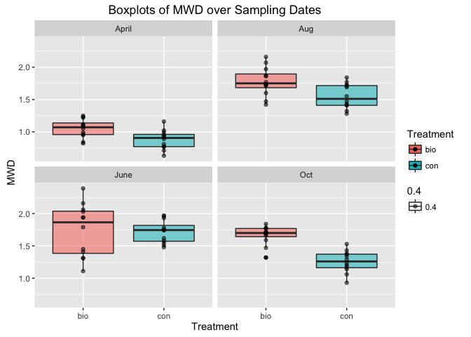
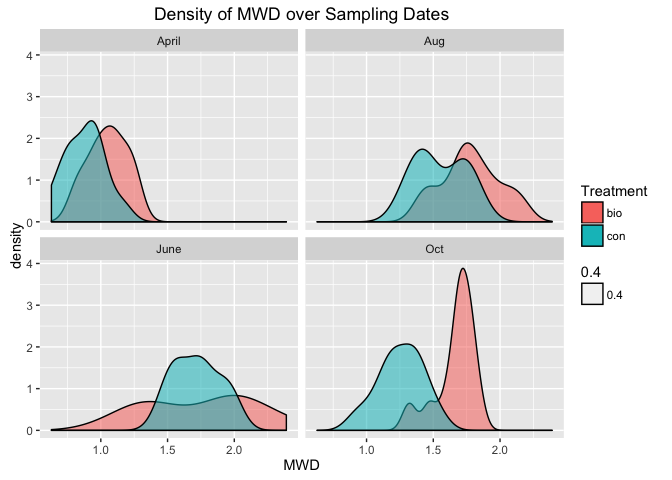
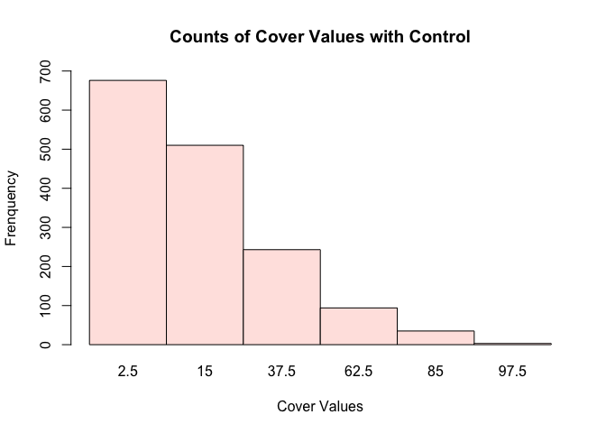
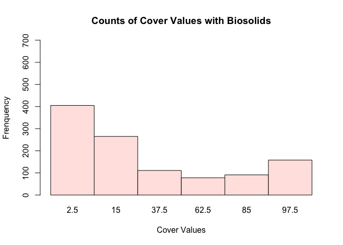
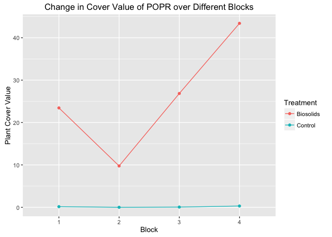
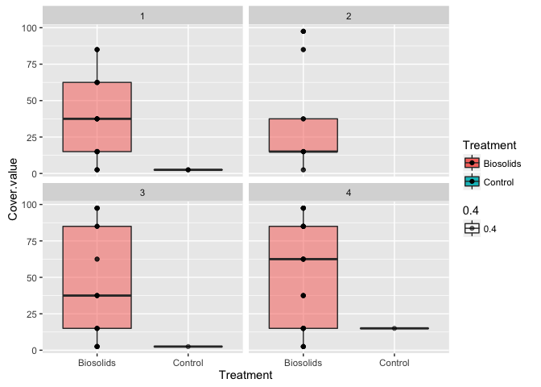
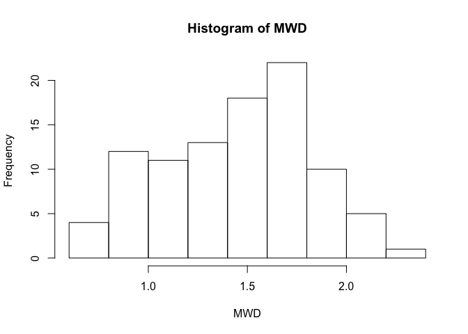
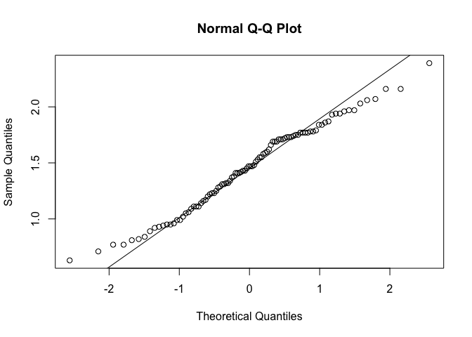
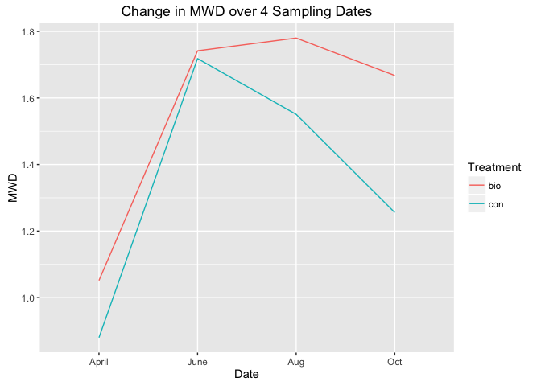
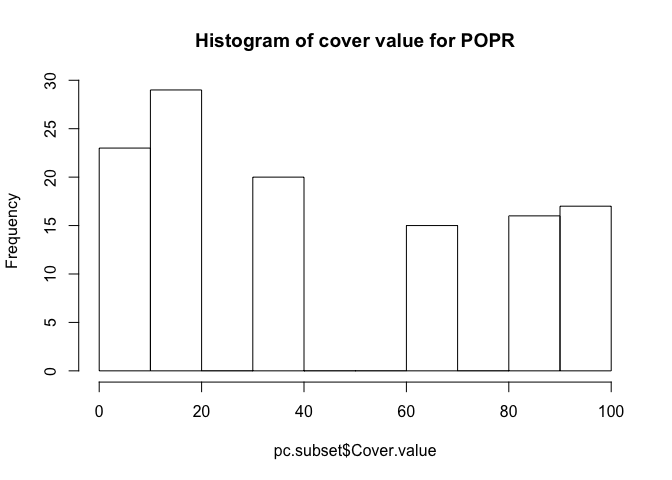

#### Summary

This report examines the effectiveness of biosolids, a new kind of
fertilizer that potentially enhances soil activity by providing food
source through microbial activities. In particular, we compare the
change in Mean Weight Diameter (MWD), a parameter measuring soil
stability, and the change in cover value, a criterion for abundance of
plant species between observations under biosolids and control. The
impact of biosolids on soil stability is analyzed by a mixed effect
model. The effect on abundance of plant species is addressed by linear
regression. We also calculate the correlation between MWD and cover
value to examine if they move in the same direction. We find strong
evidence to support the hypothesis that biosolids significantly
increases soil productivity and coverage of certain plant species.

#### 1. Introduction

Soil health and productivity is an important issue affecting our daily
lives and social well-being. Our client, Miss Emma Avery, is completing
her Master of Soil Science thesis which investigates the long term
impact of biosolids application on grassland plant communities and soil
health. Biosolids, the main interest of the experient, is a fertilizer
of interest that provides food source for microbial activities thus
enhancing soil productivity. The experiment was established in 2002 at
OK Ranch, Jasmond, BC when four grasslands were randomly chosen and
applied either biosolids or control (no biosolids). Later, the data were
collected in 2016 and we received it in January 2017 for analysis. The
primary interest is to investigate whether Mean Weight Diameter (MWD), a
parameter that quantifies soil productivity, is affected by 1) treatment
type and 2) sampling date. The secondary interest is to explore the long
term effect of biosolids on specific plant species composition. The
third interest is to examine the correlation between MWD and the cover
value of plants. The results of this report assess the significance of
biosolids application on soil productivity and plant composition. It
potentially impacts the existing fertilizers and introduce a more
effective kind of new product. Starting with a description of dataset
and methods,the following report addresses the above questions of
interests with detailed analysis and ends with conclusions and further
discussions.

#### 2. Data Description

The experiment was laid out in 4 pieces of lands with similar
characteristics which are treated as blocks. The investigator randomly
applied biosolids to half of each block and no biosolids to the other
half. Within each half of a block, 3 equally spaced transects were
arranged. MWD data were obtained from 7 fixed sample spots along each
transect. This process was conducted four times in April, June, August
and October 2016 respectively. The dataset given to us includes the
sampling month, block index, treatment type, transect number and the MWD
averaged from those 7 soil sample for each transect.

Figure 2.1 shows the boxplots of MWD under both biosolids and control in
4 sampling dates. Figure 2.2 gives the similar idea but in terms of
density. In April, August and October, we observe that data points under
biosolids have higher MWD than those under control. It can be seen from
the upward shift of data points under biosolids in the boxplots or from
the rightward shift of density curves. In June, the data points under
biosolids overlap with those under control, but the median under
biosolids is higher (Figure 2.1). Similarly, in the density plot, even
though there is no obvious evidence of a rightward shift of biosolids
density, we see a larger proportion of observations with moderately high
MWD values (between 1.5 to 2.0). Table 2.1 shows the mean MWD for 8
treatment-block combinations.

Figure 2.1 Boxplots of MWD of biosolids and control group plotted by the
four samping dates

Figure 2.2 Density of MWD of biosolids and control group plotted by the
four samping dates

    ## Source: local data frame [8 x 4]
    ## Groups: Date [?]
    ## 
    ##     Date Treatment `mean(MWD)` `sd(MWD)`
    ##   <fctr>    <fctr>       <dbl>     <dbl>
    ## 1  April       bio    1.051667 0.1442115
    ## 2  April       con    0.880000 0.1479558
    ## 3    Aug       bio    1.780000 0.2230369
    ## 4    Aug       con    1.550833 0.1897107
    ## 5   June       bio    1.741667 0.4076057
    ## 6   June       con    1.718333 0.1732488
    ## 7    Oct       bio    1.667500 0.1461086
    ## 8    Oct       con    1.255833 0.1682238

Table 2.1 Mean and standard deviation of MWD by sampling dates and
treatment type

For the investigation of plants, 5 plant transects were laid out in half
of a block. The researchers randomly selected 10 plots from each
transect. Visual assessment was done for each plot. The species present
and the corresponding abundance was recorded. The measurement of plant
composition was quantified by cover class, a number between 1 to 6 that
describes the abundance of plant species. Cover class is then converted
to cover value which is a number in percentage and is in one-to-one
correspondence to cover class. Therefore there are 6 fixed levels of
cover values in total. The dataset includes the plant species name,
block index, treatment type, plot number, cover class and cover value.
If researchers did not observe a species for certain plots, the entry of
that species is omitted instead of being recorded as 0. In the following
analysis, we specifically investigate one species, POPR.

Table 2.2 describes the frequencies of cover values appearing under
biosolids application and control for all species. The bar graph (figure
2.3 and 2.4) provide a better visualization for the results in table
2.2. We observe that when changing from control group to biosolids
group, there is a dramatic decrease in number of observations with low
cover values (\<=37.5), and an increase in number of observations with
high cover values (\>37.5). For the specific species POPR, table 2.3
summarizes the frequencies of observations under 6 levels of cover
values for biosolids and control respectively. There is a significant
difference between counts under two kinds of treatments, indicating that
biosolids is potentially effective.

    ## Source: local data frame [8 x 4]
    ## Groups: Block [?]
    ## 
    ##    Block Treatment `mean(Cover.value)` `sd(Cover.value)`
    ##   <fctr>    <fctr>               <dbl>             <dbl>
    ## 1      1 Biosolids            32.70764          35.28365
    ## 2      1   Control            17.30952          18.18493
    ## 3      2 Biosolids            28.90365          32.73254
    ## 4      2   Control            15.17857          17.42308
    ## 5      3 Biosolids            40.47071          38.97941
    ## 6      3   Control            21.96884          23.51373
    ## 7      4 Biosolids            33.51124          36.84526
    ## 8      4   Control            16.77356          20.23028

Table 2.1 Mean and standard deviation of cover value by block and
treatment type

    ## $Biosolids
    ## 
    ##  2.5   15 37.5 62.5   85 97.5 
    ##  405  265  111   78   91  158 
    ## 
    ## $Control
    ## 
    ##  2.5   15 37.5 62.5   85 97.5 
    ##  676  510  243   94   35    3

Table 2.2 Number of observation in each class of cover value presented
by treatment groups

Figure 2.3 Bar graph of frequencies in each class of cover value for
control group

Figure 2.4 Bar graph of frequencies in each class of cover value for
biosolids group

    ## $Biosolids
    ## 
    ##  2.5   15 37.5 62.5   85 97.5 
    ##   19   28   20   15   16   17 
    ## 
    ## $Control
    ## 
    ## 2.5  15 
    ##   4   1

Table 2.3 Frequencies of observations in each class of cover value
presented by treatment groups for species POPR

Figure 2.5 provides a visualization of change in cover value over
different blocks under both biosolids and control for POPR. Each point
represents the mean cover value under a specific treatment and block
combination. The observed cover value under control group are close to 0
in all four blocks while the cover values under biosolids are quite
high.

Figure 2.5 Change in cover value of species POPR over the four blocks
for control and biosolids group

Figure 2.6 Boxplots of cover value of species POPR in biosolids and
control group plotted by the four blocks

#### 3. Methods

##### Long term impact of biosolids on soil (MWD)

We use mixed-effect linear model which has both fixed and random
effects. In our context, MWD is the response variable. Treatment is a
fixed effect because the experimenters directly manipulate the
application of treatment to the soil. Date is also a fixed effect
because the four sampling dates are predetermined by the researchers.
Block is treated as a random effect because we use random effect to
handle the issue of dependencies that arise from the experimental
design.

“Repeated measurements” is the case where observations are taken from
the same subject several times. In our case, MWD is measured in roughly
the same place four times during the growing season. Therefore, the four
observations are dependent because they are affected by common
characteristics belonging to the same sampling location.

Another complication is the transects setup. It results in the problem
of “Pseudoreplication” where replicated observations are not
independent. There are two sources of pseudo replication in our case:  
\* The seven soil samples along one transect are pseudo replicates
because the soil composition measurement in one place will be highly
correlated with that five feet away.  
\* In every half of the block, the three transects are pseudo replicates
because they belong to the same experimental unit. The conditions
affecting one transect will also affect another transect in that half of
the block.

Therefore, both repeated measurements and pseudoreplication violate the
assumption of independence that is assumed in linear model. The way we
tackle this problem is to introduce a random block effect into the
model. This mixed-effect linear model will then analyze the data in a
way that is similar to randomized complete block design but with a
random block effect. Although transect is not included in the model, it
is not of particular interest to the researchers. Moreover, it is
inappropriate to investigate the variation across transects since they
are not entirely independent.

##### Long term impact of biosolids on plant cover

The same problem of pseudoreplication also appears in the plant cover
dataset. The observations within and between 5 plant transects are
dependent for the same reasons described in soil transects. The method
we use is to take the average of cover value over each treatment-block
combination. Then for treatment group, we have four independent
observations from the four blocks. For control group, we also have four
independent observations from the four blocks. For a block-treatment
combination in which experimenters did not observe any presence of POPR,
we add a cover value of 0 for that specific combination. Then we can fit
an usual linear model to this averaged dataset with the averaged cover
value as the response variable and treatment as the explanatory
variable.

In addition, averaging observations from each block-treatment
combination solves the problem that the response variable is discrete.
Since we take an average over 50 discrete observations for each
combination, the averaged cover value would be more continuous.
Therefore the usual linear model introduced above applies.

#### 4. Results

##### Long term impact of biosolids on soil

The normality assumption is validated by the histogram of MWD (Figure
4.1) and normal quantile-quantile plot (Figure 4.2). The histogram shows
that the sample distribution of MWD is approximately normal, indicating
a normal underlying distribution of MWD. The normal qq plots the sample
quantiles from MWD dataset against the theoretical quantiles from the
standard normal distribution. The fact that most of the points align
well with the straight line suggests normality.

Figure 4.1 Histogram of MWD

Figure 4.2 Normal quantile-quantile plot of MWD

We used ANOVA to compare models with different explanatory variables: \*
A p-value of 0.006 leads to the rejection of the null hypothesis at 1%
significance level. There is very strong evidence that a model including
treatment effect is very different from that without treatment
effect. \* A p-value less than 0.001 leads to the rejection of the null
hypothesis even at 0.1% significance level. There is very strong
evidence that a model including date effect is very different from that
without date effect. \* A p-value of 0.008 leads to the rejection of the
null hypothesis at 1% significance level. There is very strong evidence
that a model including interaction effect of treatment and date is very
different from that without interaction effect.

Two treatment types and four sampling dates give us eight combinations.
The intercept estimate 0.88 is the mean MWD of control group in April
(baseline group). From April to June, the mean MWD of control group
increase 0.838. This is the most dramatic increase in MWD among the four
sampling dates as Figure 4.3 shows. Moreover, all the estimates for the
main effects of dates are positive. It means that MWD always increases
as sampling dates change compared to April. As for the main effect of
biosolids on soil, mean MWD in biosolids group increases 0.172 compared
to the control group in April.

The interaction effect of treatment and sampling date account for the
extra change in MWD that is not explained by adding up the main effect
of treatment and date when compared with the baseline group. For
example, the mean MWD for biosolids group in October is 1.668, which is
0.788 units larger than that for baseline group. There is an increase of
0.376 in mean MWD from April to October. There is another increase of
0.172 in mean MWD from control group to biosolids group. But they do not
add up to 0.788. The rest of the difference between the two groups is
explained by the interaction effect between biosolids and October
(0.24). Visually from the interaction plot (Figure 4.3), we can see that
the change in mean MWD over the four sampling dates is quite different
for the two treatment groups. Especially from June to August, the mean
MWD increase for biosolids group, while the mean MWD decreases for
control group. This corroborates the significance of the interaction
effect between treatment and dates.

Figure 4.3 Change in mean of MWD over the four sampling dates

##### Long term impact of biosolids on plant cover

We check the following assumptions for linear model:  
\* Normality assumption is checked by histogram of cover value (Figure
4.4). The distribution of cover values of POPR does not look normal.
This is potentially due to the fact that cover value is not normally
distributed in nature. Since averaging and using linear regression is
our second best solution to deal with discrete cover value, we assume
that this violation of normality would not create significant bias on
results.  
\* Common variance assumption is achieved by a weaker condition that we
have equal number of observations (n=4) under biosolids and control.  
\* Independence is automatically achieved by averaging dependent
observations. Since we only have one observation from each experimental
unit (half of block), the observations satisfy independence assumption.

Figure 4.4 Histogram of cover value for species POPR

After fitting a regression model with averaged cover value per block as
response variable and treatment factor as explanatory variable, we
obtain a p-value of 0.00984 for biosolids treatment. With a p-value
smaller than 0.01, we find strong evidence to reject the null hypothesis
which biosolids and control produce indifferent cover values. The
estimated coefficient for biosolids treatment is 25.738. It means that
when changing from control to biosolids, we would expect an estimated
increase of 25.738 in cover value of POPR.

##### Correlation between MWD and cover value

Since there are unequal number of observations of MWD and cover value,
we test correlation using the eight means from the eight combinations of
treatment and block for both MWD and cover value. The estimated
correlation is 0.645 which indicates moderately strong positive
relationship between MWD and cover value. It means that MWD and cover
value vary in the same direction and such dependency relationship is
moderately strong.

#### 5. Conclusions

There is strong evidence that biosolids application and sampling dates
have significant impact on improving soil productivity. They affect MWD
interactively instead of individually. There is also strong evidence
that biosolids application increases the abundance of certain plant
species. There is a moderate positive correlation between MWD and cover
value. Better soil quality stimulates more growth of the plants.

Including treatment, block and date, the models mentioned in Method
section are relatively simple but informative about the significance of
biosolids application on MWD. A more complicated model would incorporate
the nested design in order to capture how transects might affect the
conclusion. As for plant species investigation, ordinal regression is
more appropriate because cover value is a discrete variable. In terms of
the experimental design, we recommend that researchers increase the
number of blocks instead of transects in order to increase the number of
independent observations. Moreover, soil/plant samples could be taken
randomly in blocks instead of in fixed transects. Because proper
randomization can balance potentially important explanatory variables at
the design stage.

#### 6. Appendix

[link to our Github repository](https://github.com/fjhohura/Stat550)
