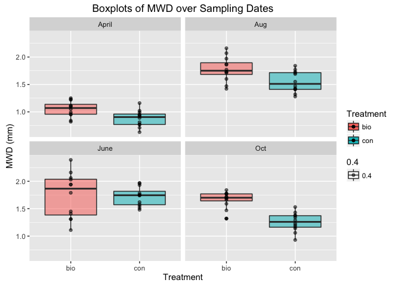
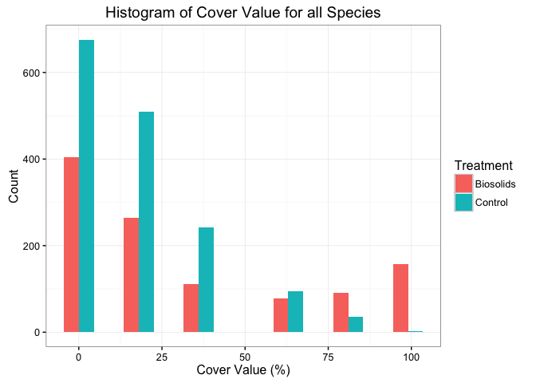
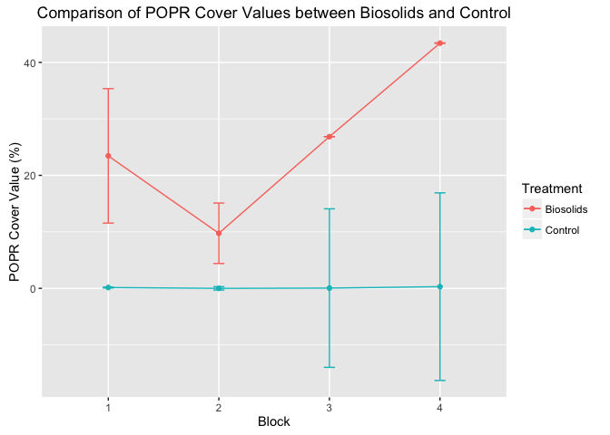
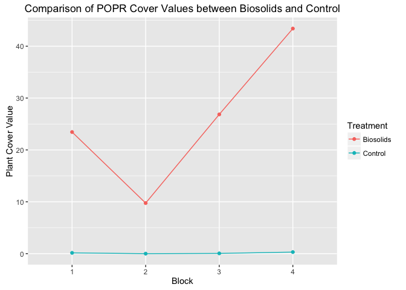
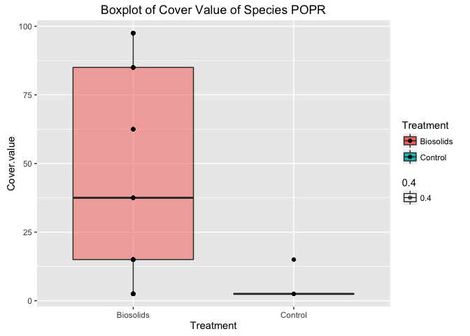
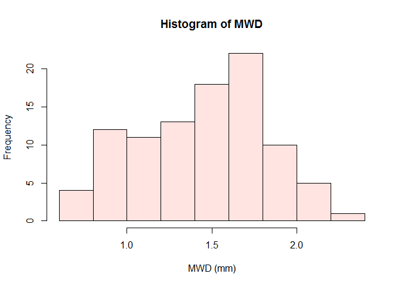
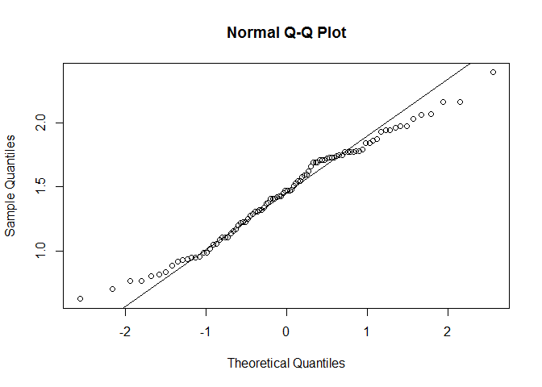
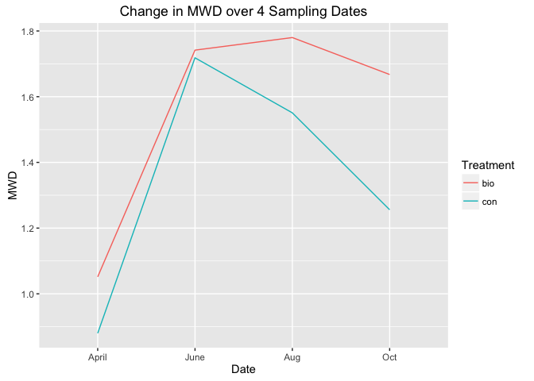

Summary
-------

This report examines the effectiveness of biosolids, a treatment that
potentially enhances soil activity by providing a food source through
microbial activities. In particular, we compare the magnitude of Mean
Weight Diameter (MWD), a parameter measuring soil stability, with and
without biosolids treatment. We also compare the magnitude of cover
value, a criterion for spread of plant species, between observations
under biosolids and control. The impact of biosolids on soil stability
is analyzed by a mixed effect model. The effect on spread of plant
species is addressed by linear regression. The correlation between MWD
and cover value is also examined. We find strong evidence that biosolids
significantly increases soil stability and coverage of certain plant
species. We also find that MWD and cover value are positively
correlated.

1. Introduction
---------------

Soil quality is an important issue affecting agricultural activities and
biodiversity. Our client, Emma Avery, is completing her thesis for
Master of Soil Science degree which investigates the long term impact of
biosolids on soil health and grassland plant communities. Biosolids, the
main interest of the experiment, is able to provide a food source for
microbial activities thus enhancing soil stability. The experiment was
conducted in 2002 at OK Ranch, Jesmond, BC. Four grasslands were
randomly chosen and either applied biosolids or left as control (no
biosolids). Later, the data were collected in 2016 and passed on to us
in January 2017 for analysis. This report’s primary interest is to
investigate whether Mean Weight Diameter (MWD), a parameter that
quantifies soil productivity, is affected by 1) treatment type and 2)
sampling date. The secondary interest is to explore the effect of
biosolids on specific plant species composition. The third interest is
to examine the correlation between MWD and the cover value of plants.
The report assesses the significance of biosolids treatment and
indicates that biosolids performs well in terms of enhancing soil
stability and increasing spread of plant species. Starting with a
description of dataset and methods, the report addresses the above
questions of interests with detailed analysis and ends with conclusions
and further discussions.

2. Data Description
-------------------

The experiment was laid out in 4 pieces of lands with similar
characteristics which are treated as blocks. The investigator randomly
applied biosolids to half of each block and no biosolids to the other
half. Within each half of a block, 3 equally spaced transects were
arranged. MWD(mm) data were obtained from 7 fixed sample spots along
each transect. This process was conducted four times: April, June,
August and October 2016 respectively. The dataset given to us includes
the sampling month, block index, treatment type, transect number and the
MWD averaged from those 7 soil samples for each transect. So the total
number of soil samples is 96 (4 sampling dates x 4 blocks x 2 treatments
x 3 transects x 1 composite sample per transect).

Figure 2.1 shows the boxplots of MWD under both biosolids and control in
4 sampling dates. In April, August and October, we observe that data
points under biosolids have higher MWD than those under control. This
can be seen from the upward shift of data points under biosolids in the
boxplots. In June, the data points under biosolids overlap with those
under control, but the median under biosolids is higher. Table 2.1 shows
the mean and standard deviation of MWD for 8 treatment-block
combinations.

Figure 2.1 Boxplots of MWD of biosolids and control group plotted by the
four samping dates. The four plots represent the four months. MWD is
plotted against treatment type (biosolids as pink, control as green) in
each month.

    ## Source: local data frame [8 x 4]
    ## Groups: Date [?]
    ## 
    ##     Date Treatment `mean(MWD)` `sd(MWD)`
    ##   <fctr>    <fctr>       <dbl>     <dbl>
    ## 1  April       bio    1.051667 0.1442115
    ## 2  April       con    0.880000 0.1479558
    ## 3    Aug       bio    1.780000 0.2230369
    ## 4    Aug       con    1.550833 0.1897107
    ## 5   June       bio    1.741667 0.4076057
    ## 6   June       con    1.718333 0.1732488
    ## 7    Oct       bio    1.667500 0.1461086
    ## 8    Oct       con    1.255833 0.1682238

Table 2.1 Mean and standard deviation of MWD by sampling dates and
treatment type.

For the investigation of plants, 5 plant transects were laid out in half
of a block. The researchers randomly selected 10 plots from each
transect. Visual assessment was done for each plot. The species present
and the corresponding abundance were recorded. The measurement of plant
composition was quantified by cover class, a number from 1 to 6 that
assesses the canopy cover of plant species. Cover class was then
converted to cover value which is a number in percentage and is in
one-to-one correspondence to cover class. For example, cover class 1
represents a cover from 0% to 5%. The midpoint 2.5% is the cover value
corresponding to cover class 1. Therefore there are 6 cover values in
the dataset: 2.5%, 15%, 37.5%, 62.5%, 85%, 97.5%. The dataset includes
the plant species name, block index, treatment type, plot number, cover
class and cover value. The total number of plant assessments is 400 (4
blocks × 2 treatments × 5 transects × 10 samples per transect). If
researchers did not observe a species for certain plots, the entry of
that species is omitted instead of being recorded as 0. In the following
analysis, we specifically investigate one species, Poa pratensis (POPR).

The histogram (Figure 2.2) describes the frequencies of cover values
appearing under biosolids and control for all species. Biosolids group
has more observations with high cover values, while control group has
more observations with low cover values. For the specific species POPR,
Table 2.2 summarizes the frequencies of observations under 6 levels of
cover values for biosolids and control respectively. The counts under
two treatments are quite different, indicating that biosolids is
potentially effective.

    ## Source: local data frame [8 x 4]
    ## Groups: Block [?]
    ## 
    ##    Block Treatment `mean(Cover.value)` `sd(Cover.value)`
    ##   <fctr>    <fctr>               <dbl>             <dbl>
    ## 1      1 Biosolids            32.70764          35.28365
    ## 2      1   Control            17.30952          18.18493
    ## 3      2 Biosolids            28.90365          32.73254
    ## 4      2   Control            15.17857          17.42308
    ## 5      3 Biosolids            40.47071          38.97941
    ## 6      3   Control            21.96884          23.51373
    ## 7      4 Biosolids            33.51124          36.84526
    ## 8      4   Control            16.77356          20.23028

Table 2.1 Mean and standard deviation of cover value by block and
treatment type.

Figure 2.2 Overlapped histogram in each class of cover value for all
species. The cover values are 2.5, 15, 37.5, 62.5, 85 and 97.5.

    ## $Biosolids
    ## 
    ##  2.5   15 37.5 62.5   85 97.5 
    ##   19   28   20   15   16   17 
    ## 
    ## $Control
    ## 
    ## 2.5  15 
    ##   4   1

Table 2.2 Frequencies of observations in each class of cover value
presented by treatment groups for species POPR. The cover values are
2.5, 15, 37.5, 62.5, 85 and 97.5. The number under cover value is the
count in that group.

Figure 2.3 and 2.4 provide visualizations of change and variation in
cover values under both biosolids and control for POPR. Each point
represents the mean cover value under a specific treatment-block
combination. The observed cover values under control group are close to
0 in all four blocks while the cover values under biosolids are quite
high. We also observe that the change in cover value for biosolids group
is different in four blocks. But we do not consider any interaction
effects involving block because they are not of interest.

Figure 2.3 Comparison of species POPR cover values between control and
biosolids group. Cover values in biosolids group are a lot higher than
those in control group for all the blocks.

Figure 2.4 Boxplots of cover value of species POPR in biosolids and
control group.

3. Methods
----------

### Long term impact of biosolids on soil (MWD)

We use a mixed-effect linear model which has both fixed and random
effects. In our context, MWD is the response variable. Treatment is a
fixed effect, because the experimenters directly manipulate the
application of treatment to the soil. Date is also a fixed effect,
because the four sampling dates are predetermined by the researchers.
Block is treated as a random effect, because we use random effect to
handle the issue of dependencies that arise from the experimental
design.

There are two features in the design:

“Repeated measurements” is the case where observations are taken from
the same subject several times. In our case, MWD is measured in roughly
the same place four times during the growing season. These four
observations are dependent, because they are affected by common
characteristics belonging to the same sampling location.

Another feature is the transects setup. It results in the problem of
“pseudoreplication” where replicated observations are not independent.
There are two sources of pseudo replication in our case:

-   The seven soil samples along one transect are pseudo replicates.
    Because the soil composition measurement in one place is highly
    correlated with that five feet away.  
-   In every half of the block, the three transects are pseudo
    replicates. Because they belong to the same experimental unit. The
    conditions affecting one transect also affect another transect in
    that half of the block.

Therefore, both repeated measurements and pseudoreplication violate the
assumption of independence that is assumed in linear models. The way we
tackle this problem is to introduce a random block effect into the
model. This mixed-effect linear model will then analyze the data in a
way that is similar to randomized complete block design but with a
random block effect. Although transect is not included in the model, it
is not of particular interest to the researchers.

### Long term impact of biosolids on plant cover

The same problem of pseudoreplication also appears in the plant cover
dataset. The observations within and between 5 plant transects are
dependent for the same reasons described in soil transects. The method
we use is to take the average of cover value over each treatment-block
combination. Then we have four independent observations from the four
blocks for both biosolids and control treatment groups. For a
block-treatment combination in which experimenters did not observe any
presence of POPR, we add a cover value of 0 for that specific
combination. Then we fit a usual linear model to this averaged dataset
with the averaged cover value as the response variable and treatment as
the explanatory variable.

In addition, averaging observations from each block-treatment
combination relieves the problem that the response variable is discrete.
Since we take an average over 50 discrete observations for each
combination, the averaged cover value resembles the underlying
continuous values. Therefore the usual linear model introduced above
applies.

4. Results
----------

### Long term impact of biosolids on soil

The normality assumption is validated by the histogram of MWD (Figure
4.1) and normal quantile-quantile plot (Figure 4.2). The histogram shows
that the sample distribution of MWD is approximately normal, indicating
a normal underlying distribution of MWD. The normal QQ plot shows the
sample quantiles from MWD dataset against the theoretical quantiles from
the standard normal distribution. The fact that most of the points align
well with the straight line suggests normality.

Figure 4.1 Histogram of MWD.

Figure 4.2 Normal quantile-quantile plot of MWD.

We use Chi-square test to investigate the significance of treatment
effect, date effect and treatment-date interaction effect respectively:

-   A p-value of 0.006 shows strong evidence that treatment main effect
    is significant at 1% significance level.
-   A p-value less than 0.001 shows very strong evidence that date main
    effect is significant even at 0.1% significance level.
-   A p-value of 0.008 shows strong evidence that treatment-date
    interaction effect is significant at 1% significance level.

Two treatment types and four sampling dates give us eight combinations.
The intercept estimate 0.88 is the mean MWD of control group in April
(baseline group). From April to June, the mean MWD of control group
increase by 0.838mm [0.719mm, 0.956mm] with 95% confidence. This is the
most dramatic increase in MWD among the four sampling dates as Figure
4.3 shows. Moreover, all the estimates for the main effects of dates are
positive. It means that MWD always increases as sampling dates change
compared to April. Keeping date fixed in April, June, August, and
October, MWD increases by 0.172mm [0.054mm, 0.261mm], 0.023mm [-0.235mm,
0.248mm], 0.229mm [0.058mm, 0.422mm], and 0.412mm [0.265mm, 0.522mm]
respectively with 95% confidence.

The treatment-date interaction effect accounts for the extra change in
MWD that is not explained by adding up the main effect of treatment and
date when compared with the baseline group. For example, the mean MWD
for biosolids group in October is 1.668mm, which is 0.788mm larger than
that for baseline group. There is an increase of 0.376mm in mean MWD
from April to October. There is another increase of 0.172mm in mean MWD
from control group to biosolids group. But they do not add up to
0.788mm. The rest of the difference between the two groups is explained
by the interaction effect between biosolids and October (0.240mm with
95% confidence interval [0.085mm, 0.409mm]). Visually from the
interaction plot (Figure 4.3), we can see that the change in mean MWD
over the four sampling dates is quite different for the two treatment
groups. Especially from June to August, the mean MWD increase for
biosolids group, while the mean MWD decreases for control group. This
corroborates the significance of the interaction effect between
treatment and date.

Figure 4.3 Change in mean of MWD over the four sampling dates.

### Long term impact of biosolids on plant cover

We check the following assumptions for linear model:

-   Normality assumption is checked by histogram of cover value (Figure
    4.4). The distribution of cover values of POPR does not look normal.
    This is potentially due to the fact that cover value is not normally
    distributed in nature. In addition, the sample size of the averaged
    dataset is too small to appear normal. Since averaging and using
    linear regression is our second best solution to deal with discrete
    cover value, we assume that this violation of normality would not
    create significant bias on results.  
-   Common variance assumption is achieved by a weaker condition that we
    have equal number of observations (n=4) under biosolids and
    control.  
-   Independence is automatically achieved by averaging dependent
    observations. Since we only have one observation from each
    experimental unit (half of a block), the observations satisfy the
    independence assumption.

Figure 4.4 Histogram of cover value for species POPR.

After fitting a regression model with averaged cover value per block as
response variable and treatment factor as explanatory variable, we
obtain a p-value of 0.00984 for biosolids treatment. With a p-value
smaller than 0.01, we find strong evidence to reject the null hypothesis
that biosolids and control produce indifferent cover values. When
changing from control to biosolids, we expect an estimated increase of
25.738% [8.815%, 42.661%] in cover value of POPR with 95% confidence.

### Correlation between MWD and cover value

Since there are an unequal number of observations of MWD and cover
value, we test correlation using the eight means from the eight
treatment-block combinations for both MWD and cover value. The estimated
correlation is 0.645 which indicates a moderately strong positive
relationship between MWD and cover value. It means that when soil
becomes more stable (larger MWD), the canopy cover of POPR increases,
which is intuitive.

5. Conclusions & Furthur Discussion
-----------------------------------

There is strong evidence that biosolids treatment and sampling dates
have significant impact on improving soil stability. They affect MWD
interactively instead of individually. There is also strong evidence
that biosolids application increases the spread of species POPR. There
is a moderate positive correlation between MWD and cover value. In
conclusion, biosolids is an effective treatment that enhances soil
stability and plant canopy cover. Better soil quality is associated with
more growth of the plants.

For further studies, ordinal regression is more appropriate for plant
investigation because cover value is a discrete variable. In terms of
the experimental design, we recommend that researchers increase the
number of blocks instead of transects. With an increase in the number of
independent observations, the response variable would be closer to
normality and the standard errors of the estimated coefficients would be
smaller. Moreover, soil and plant samples could be taken randomly in
blocks instead of in fixed transects since proper randomization may
eliminate potential bias at the design stage.

6. Appendix
-----------

[link to our Github repository for R code and
output](https://github.com/fjhohura/Stat550)
