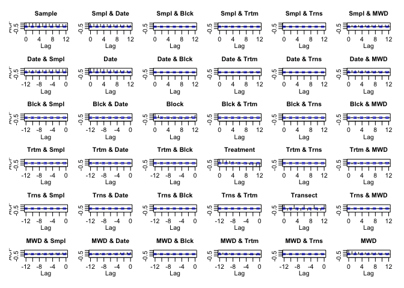
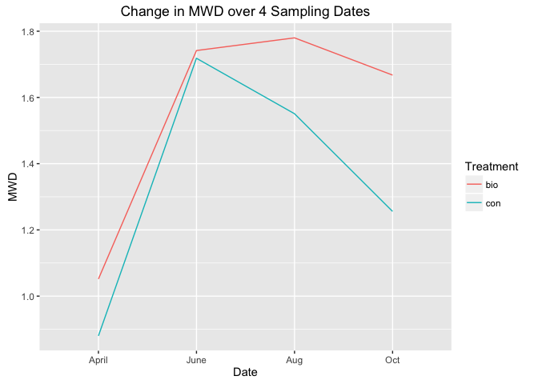
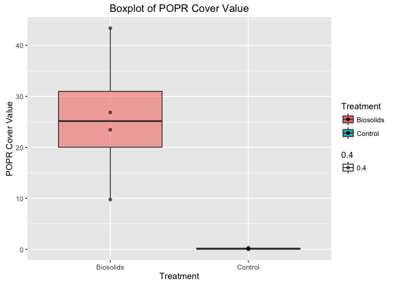

LONG TERM IMPACTS OF BIOSOLIDS ON MWD
-------------------------------------

### Explore the data

    library("ggplot2")
    library(lme4)
    library(reshape2)
    library(MASS)
    library(dplyr)
    library(base)

    soil<-read.table("MWD.csv", sep = ",", header = T) 
    head(soil)

    ##   Sample  Date Block Treatment Transect  MWD
    ## 1      1 April    b1       bio        1 1.05
    ## 2      2 April    b1       bio        2 0.95
    ## 3      3 April    b1       bio        3 0.99
    ## 4      4 April    b3       bio        1 0.82
    ## 5      5 April    b3       bio        2 0.84
    ## 6      6 April    b3       bio        3 0.96

    str(soil)

    ## 'data.frame':    96 obs. of  6 variables:
    ##  $ Sample   : int  1 2 3 4 5 6 7 8 9 10 ...
    ##  $ Date     : Factor w/ 4 levels "April","Aug",..: 1 1 1 1 1 1 1 1 1 1 ...
    ##  $ Block    : Factor w/ 4 levels "b1","b2","b3",..: 1 1 1 3 3 3 2 2 2 4 ...
    ##  $ Treatment: Factor w/ 2 levels "bio","con": 1 1 1 1 1 1 1 1 1 1 ...
    ##  $ Transect : int  1 2 3 1 2 3 1 2 3 1 ...
    ##  $ MWD      : num  1.05 0.95 0.99 0.82 0.84 0.96 1.11 1.25 1.11 1.23 ...

    with(soil,table(Treatment, Date))

    ##          Date
    ## Treatment April Aug June Oct
    ##       bio    12  12   12  12
    ##       con    12  12   12  12

    group_by(soil,Date,Treatment) %>%
      summarise(mean(MWD))

    ## Source: local data frame [8 x 3]
    ## Groups: Date [?]
    ## 
    ##     Date Treatment `mean(MWD)`
    ##   <fctr>    <fctr>       <dbl>
    ## 1  April       bio    1.051667
    ## 2  April       con    0.880000
    ## 3    Aug       bio    1.780000
    ## 4    Aug       con    1.550833
    ## 5   June       bio    1.741667
    ## 6   June       con    1.718333
    ## 7    Oct       bio    1.667500
    ## 8    Oct       con    1.255833

### Looking and understanding the data

> S550: Great exploratory analysis. But what is the motivation behind
> the qqnorm plot? It might not be required for the model we are using.
> Also, what information does the acf() plot give us? What do you want
> to show by acf(soil)?

> S550: Some comments above chunks of code would be useful, to state
> what some of the lesser-known functions do.

> S550: What you get by using this plot design?

    hist(soil$MWD, xlab="MWD", main = "Histogram of MWD")


    ggplot(aes(MWD, fill = Treatment, alpha = 0.4), data=soil) + geom_density() + facet_wrap(~Date)


    ggplot(aes(y=MWD, x=Treatment, fill = Treatment, alpha = 0.4), data=soil) + geom_boxplot() + geom_point() + facet_wrap(~Date)


    tapply(soil$MWD, soil$Treatment, mean)

    ##      bio      con 
    ## 1.560208 1.351250

    tapply(soil$MWD, soil$Treatment, sd)

    ##       bio       con 
    ## 0.3874274 0.3616547

    qqnorm(soil$MWD)
    qqline(soil$MWD)


    acf(soil)



    Transect.f<-as.factor(soil$Transect)
    plot.design(MWD~Treatment+Block+Date+Transect.f, data = soil, xlab="Treatment", ylab="MWD")


    Date.f = factor(soil$Date,levels(soil$Date)[c(1, 3, 2, 4)])
    ggplot(soil, aes(x = Date.f, y = MWD, group = Treatment, colour = Treatment)) +
      stat_summary(fun.y="mean", geom = "line") +
      labs(x = "Date", title = "Change in MWD over 4 Sampling Dates")



    interaction.plot(soil$Block,soil$Treatment,soil$MWD)


### Analysis

A simple model to start with:  
- Randomized complete block design (but block effect as random)  
- Ignore the transects and repeated measurements for now  
- Treat the transects as pseudo-replication

    soil.rcb1<-lmer(MWD~Treatment+(1|Block), soil)  
    summary(soil.rcb1)

    ## Linear mixed model fit by REML ['lmerMod']
    ## Formula: MWD ~ Treatment + (1 | Block)
    ##    Data: soil
    ## 
    ## REML criterion at convergence: 89.4
    ## 
    ## Scaled residuals: 
    ##     Min      1Q  Median      3Q     Max 
    ## -1.8460 -0.8817  0.1860  0.6827  2.1580 
    ## 
    ## Random effects:
    ##  Groups   Name        Variance Std.Dev.
    ##  Block    (Intercept) 0.004282 0.06544 
    ##  Residual             0.137167 0.37036 
    ## Number of obs: 96, groups:  Block, 4
    ## 
    ## Fixed effects:
    ##              Estimate Std. Error t value
    ## (Intercept)   1.56021    0.06268  24.894
    ## Treatmentcon -0.20896    0.07560  -2.764
    ## 
    ## Correlation of Fixed Effects:
    ##             (Intr)
    ## Treatmentcn -0.603

    plot(soil.rcb1)


    soil.rcb2<-lmer(MWD~(1|Block), soil)
    summary(soil.rcb2)

    ## Linear mixed model fit by REML ['lmerMod']
    ## Formula: MWD ~ (1 | Block)
    ##    Data: soil
    ## 
    ## REML criterion at convergence: 93.5
    ## 
    ## Scaled residuals: 
    ##     Min      1Q  Median      3Q     Max 
    ## -2.0288 -0.7462  0.1153  0.7449  2.3642 
    ## 
    ## Random effects:
    ##  Groups   Name        Variance Std.Dev.
    ##  Block    (Intercept) 0.00387  0.06221 
    ##  Residual             0.14707  0.38349 
    ## Number of obs: 96, groups:  Block, 4
    ## 
    ## Fixed effects:
    ##             Estimate Std. Error t value
    ## (Intercept)  1.45573    0.04999   29.12

    plot(soil.rcb2)


    anova(soil.rcb1,soil.rcb2)

    ## refitting model(s) with ML (instead of REML)

    ## Data: soil
    ## Models:
    ## soil.rcb2: MWD ~ (1 | Block)
    ## soil.rcb1: MWD ~ Treatment + (1 | Block)
    ##           Df    AIC    BIC  logLik deviance  Chisq Chi Df Pr(>Chisq)   
    ## soil.rcb2  3 95.224 102.92 -44.612   89.224                            
    ## soil.rcb1  4 89.807 100.06 -40.904   81.807 7.4166      1   0.006463 **
    ## ---
    ## Signif. codes:  0 '***' 0.001 '**' 0.01 '*' 0.05 '.' 0.1 ' ' 1

Add Date to the model

    soil.date<-lmer(MWD~Treatment+Date+(1|Block), soil)
    summary(soil.date)

    ## Linear mixed model fit by REML ['lmerMod']
    ## Formula: MWD ~ Treatment + Date + (1 | Block)
    ##    Data: soil
    ## 
    ## REML criterion at convergence: -5.3
    ## 
    ## Scaled residuals: 
    ##     Min      1Q  Median      3Q     Max 
    ## -2.9440 -0.5482  0.0974  0.6313  2.3773 
    ## 
    ## Random effects:
    ##  Groups   Name        Variance Std.Dev.
    ##  Block    (Intercept) 0.008169 0.09038 
    ##  Residual             0.043872 0.20946 
    ## Number of obs: 96, groups:  Block, 4
    ## 
    ## Fixed effects:
    ##              Estimate Std. Error t value
    ## (Intercept)   1.07031    0.06578  16.270
    ## Treatmentcon -0.20896    0.04276  -4.887
    ## DateAug       0.69958    0.06047  11.570
    ## DateJune      0.76417    0.06047  12.638
    ## DateOct       0.49583    0.06047   8.200
    ## 
    ## Correlation of Fixed Effects:
    ##             (Intr) Trtmnt DateAg DateJn
    ## Treatmentcn -0.325                     
    ## DateAug     -0.460  0.000              
    ## DateJune    -0.460  0.000  0.500       
    ## DateOct     -0.460  0.000  0.500  0.500

    plot(soil.date)


    anova(soil.rcb1,soil.date)

    ## refitting model(s) with ML (instead of REML)

    ## Data: soil
    ## Models:
    ## soil.rcb1: MWD ~ Treatment + (1 | Block)
    ## soil.date: MWD ~ Treatment + Date + (1 | Block)
    ##           Df     AIC     BIC  logLik deviance  Chisq Chi Df Pr(>Chisq)    
    ## soil.rcb1  4  89.807 100.065 -40.904   81.807                             
    ## soil.date  7 -12.149   5.802  13.074  -26.149 107.96      3  < 2.2e-16 ***
    ## ---
    ## Signif. codes:  0 '***' 0.001 '**' 0.01 '*' 0.05 '.' 0.1 ' ' 1

Add interaction effect

    soil$Treatment <- relevel(soil$Treatment, ref = "con")
    soil.mult<-lmer(MWD~Treatment*Date+(1|Block), soil)
    summary(soil.mult)

    ## Linear mixed model fit by REML ['lmerMod']
    ## Formula: MWD ~ Treatment * Date + (1 | Block)
    ##    Data: soil
    ## 
    ## REML criterion at convergence: -8.4
    ## 
    ## Scaled residuals: 
    ##     Min      1Q  Median      3Q     Max 
    ## -2.6096 -0.5821 -0.0017  0.6172  2.9457 
    ## 
    ## Random effects:
    ##  Groups   Name        Variance Std.Dev.
    ##  Block    (Intercept) 0.008332 0.09128 
    ##  Residual             0.039961 0.19990 
    ## Number of obs: 96, groups:  Block, 4
    ## 
    ## Fixed effects:
    ##                       Estimate Std. Error t value
    ## (Intercept)            0.88000    0.07357  11.961
    ## Treatmentbio           0.17167    0.08161   2.104
    ## DateAug                0.67083    0.08161   8.220
    ## DateJune               0.83833    0.08161  10.272
    ## DateOct                0.37583    0.08161   4.605
    ## Treatmentbio:DateAug   0.05750    0.11541   0.498
    ## Treatmentbio:DateJune -0.14833    0.11541  -1.285
    ## Treatmentbio:DateOct   0.24000    0.11541   2.079
    ## 
    ## Correlation of Fixed Effects:
    ##             (Intr) Trtmnt DateAg DateJn DatOct Trt:DA Trt:DJ
    ## Treatmentbi -0.555                                          
    ## DateAug     -0.555  0.500                                   
    ## DateJune    -0.555  0.500  0.500                            
    ## DateOct     -0.555  0.500  0.500  0.500                     
    ## Trtmntb:DtA  0.392 -0.707 -0.707 -0.354 -0.354              
    ## Trtmntb:DtJ  0.392 -0.707 -0.354 -0.707 -0.354  0.500       
    ## Trtmntb:DtO  0.392 -0.707 -0.354 -0.354 -0.707  0.500  0.500

    plot(soil.mult)


    anova(soil.date,soil.mult)

    ## refitting model(s) with ML (instead of REML)

    ## Data: soil
    ## Models:
    ## soil.date: MWD ~ Treatment + Date + (1 | Block)
    ## soil.mult: MWD ~ Treatment * Date + (1 | Block)
    ##           Df     AIC    BIC logLik deviance  Chisq Chi Df Pr(>Chisq)   
    ## soil.date  7 -12.149 5.8017 13.074  -26.149                            
    ## soil.mult 10 -17.931 7.7128 18.965  -37.931 11.782      3   0.008169 **
    ## ---
    ## Signif. codes:  0 '***' 0.001 '**' 0.01 '*' 0.05 '.' 0.1 ' ' 1

LONG TERM IMPACTS OF BIOSOLIDS ON PLANT COVER
---------------------------------------------

### Data Exploration

    pc <- read.csv("plant_cover.csv", header = T)
    str(pc)

    ## 'data.frame':    2669 obs. of  9 variables:
    ##  $ Project    : Factor w/ 1 level "OK Ranch Biosolids Resample": 1 1 1 1 1 1 1 1 1 1 ...
    ##  $ Date       : Factor w/ 2 levels "June 21, 2016",..: 1 1 1 1 1 1 1 1 1 1 ...
    ##  $ Block      : int  1 1 1 1 1 1 1 1 1 1 ...
    ##  $ Treatment  : Factor w/ 2 levels "Biosolids","Control": 1 1 1 1 1 1 1 1 1 1 ...
    ##  $ Transect   : int  1 1 1 1 1 1 1 1 1 1 ...
    ##  $ Plot       : int  2 2 2 2 2 2 2 2 2 3 ...
    ##  $ Species    : Factor w/ 50 levels "ACMI","ACRI",..: 1 3 9 11 29 33 39 47 48 3 ...
    ##  $ Cover.class: int  1 1 1 2 4 5 3 3 1 2 ...
    ##  $ Cover.value: num  2.5 2.5 2.5 15 62.5 85 37.5 37.5 2.5 15 ...

    pc$Block <- as.factor(pc$Block)

    # for whole dataset
    group_by(pc,Block,Treatment) %>%
      summarise(mean(Cover.value), sd(Cover.value))

    ## Source: local data frame [8 x 4]
    ## Groups: Block [?]
    ## 
    ##    Block Treatment `mean(Cover.value)` `sd(Cover.value)`
    ##   <fctr>    <fctr>               <dbl>             <dbl>
    ## 1      1 Biosolids            32.70764          35.28365
    ## 2      1   Control            17.30952          18.18493
    ## 3      2 Biosolids            28.90365          32.73254
    ## 4      2   Control            15.17857          17.42308
    ## 5      3 Biosolids            40.47071          38.97941
    ## 6      3   Control            21.96884          23.51373
    ## 7      4 Biosolids            33.51124          36.84526
    ## 8      4   Control            16.77356          20.23028

    table_sum <- tapply(pc$Cover.value,pc$Treatment, table)
    table_sum

    ## $Biosolids
    ## 
    ##  2.5   15 37.5 62.5   85 97.5 
    ##  405  265  111   78   91  158 
    ## 
    ## $Control
    ## 
    ##  2.5   15 37.5 62.5   85 97.5 
    ##  676  510  243   94   35    3

    ggplot(pc,aes(x=Cover.value,group=Treatment,fill=Treatment))+geom_histogram(position="dodge",binwidth=9)+theme_bw()+labs(title="Histogram of Cover Value for all Species")


    ggplot(aes(x = Block, y = Cover.value, group = Treatment, colour = Treatment), data = pc)+stat_summary(fun.y="mean", geom = "line")+labs(x = "Block", y = "Plant Cover Value", title = "Change in Cover Value over Different Blocks")


    # for subset POPR
    pc.subset <- subset(pc, Species == "POPR")

    table_sum_POPR <- tapply(pc.subset$Cover.value,pc.subset$Treatment, table)
    table_sum_POPR

    ## $Biosolids
    ## 
    ##  2.5   15 37.5 62.5   85 97.5 
    ##   19   28   20   15   16   17 
    ## 
    ## $Control
    ## 
    ## 2.5  15 
    ##   4   1

    pc.subset <- pc.subset[ ,c(3,4,9)]
    by_blockTrt <- group_by(pc.subset, Block, Treatment)
    dat.avg<-summarise(by_blockTrt, y.avg=sum(Cover.value)/50)
    add2control <- c("2","Control",0)
    dat.avg[8, ] <- add2control

    dat.avg$y.avg <- as.numeric(dat.avg$y.avg)
    ggplot(aes(x = Block, y = y.avg, group = Treatment, colour = Treatment), data = dat.avg) + geom_point() + geom_line() + labs(x = "Block", y = "Plant Cover Value", title = "Change in Cover Value of POPR over Different Blocks")


    ggplot(aes(y=y.avg, x=Treatment, fill = Treatment, alpha = 0.4), data=dat.avg) + geom_boxplot() + geom_point()+ labs(y = "POPR Cover Value", title = "Boxplot of POPR Cover Value")



### Diagnostics: checking assumptions of linear models

    plot(pc.subset$Treatment, pc.subset$Cover.value)


    # similar variability of cover value within two levels of treatment although strange behaviour of Control group

    qqnorm(pc.subset$Cover.value)


    # strange behaviour due to the fact that cover value is discrete
    hist(pc.subset$Cover.value)


    # not quite normal, heavy right tail

    ggplot(aes(y=Cover.value, x=Treatment, fill = Treatment, alpha = 0.4), data=pc.subset) + geom_boxplot() + geom_point() + facet_wrap(~Block)


    # almost same variance

    #pc_sub <- pc.subset[ ,c(3,4,5,9)]
    #acf(pc_sub)
    # no multicolinearity within explnatory variables

    # Residuals are checked in the next section after imposing linear model.

> S550: Here both cover value and cover class are categorical so what
> does linear regression and diagnostics of the linear regression
> actually give? How can we check multicolinearity using acf()?

### Analysis

    pc$Block <- as.factor(pc$Block)
    pc.subset <- subset(pc, Species == "POPR")
    pc.subset <- pc.subset[ ,c(3,4,9)]

    by_blockTrt <- group_by(pc.subset, Block, Treatment)
    dat.avg<-summarise(by_blockTrt, y.avg=sum(Cover.value)/50)
    add2control <- c("2","Control",0)
    dat.avg[8, ] <- add2control
    dat.avg

    ## Source: local data frame [8 x 3]
    ## Groups: Block [?]
    ## 
    ##    Block Treatment y.avg
    ## * <fctr>    <fctr> <chr>
    ## 1      1 Biosolids 23.45
    ## 2      1   Control  0.15
    ## 3      2 Biosolids  9.75
    ## 4      3 Biosolids 26.85
    ## 5      3   Control  0.05
    ## 6      4 Biosolids  43.4
    ## 7      4   Control   0.3
    ## 8      2   Control     0

    dat.avg$Treatment <- relevel(dat.avg$Treatment, ref = "Control")
    model_avg <- lm(as.numeric(y.avg) ~ Treatment, data = dat.avg)
    summary(model_avg)

    ## 
    ## Call:
    ## lm(formula = as.numeric(y.avg) ~ Treatment, data = dat.avg)
    ## 
    ## Residuals:
    ##      Min       1Q   Median       3Q      Max 
    ## -16.1125  -0.6969  -0.0250   0.3781  17.5375 
    ## 
    ## Coefficients:
    ##                    Estimate Std. Error t value Pr(>|t|)   
    ## (Intercept)           0.125      4.891   0.026  0.98044   
    ## TreatmentBiosolids   25.738      6.916   3.721  0.00984 **
    ## ---
    ## Signif. codes:  0 '***' 0.001 '**' 0.01 '*' 0.05 '.' 0.1 ' ' 1
    ## 
    ## Residual standard error: 9.781 on 6 degrees of freedom
    ## Multiple R-squared:  0.6977, Adjusted R-squared:  0.6473 
    ## F-statistic: 13.85 on 1 and 6 DF,  p-value: 0.009838

    # MS(Treatment)/MS(Treatment:Block) = F statistic from lm output of adding-zero approach

### Correlation between Plant Cover and MWD

    a<-group_by(soil,Block,Treatment) %>%
      summarise(mean(MWD))
    b<-a$`mean(MWD)`
    mean.MWD<-c(b[1], b[2], b[3], b[5], b[6], b[7], b[8], b[4])
    mean.cv<-as.numeric(as.character(dat.avg$y.avg))
    cor(mean.MWD, mean.cv)

    ## [1] -0.6155239

### Appendix (model history)

#### Part 1

> S550: Good idea to build up the model in this way. But we can take out
> all the preliminary models when we write the final report.

A simple model to start with:  
- Randomized block design  
- Ignore the transects and repeated measurements for now  
- Treat the data collected from the transects as random samples  
- Assume no block interaction effects

Looking at the data in terms of treatment and block:

interaction.plot(soil*T**r**e**a**t**m**e**n**t*, *s**o**i**l*Block,
soil$MWD, xlab="Treatment", ylab="MWD", main="Change in MWD over
Treatments by Block")

boxcox(MWD~Block+Treatment, data=soil) \# To see if transformation on y
is needed soil.rbd\<-aov(MWD~Block+Treatment, soil) summary(soil.rbd)
plot(soil.rbd)

Adding Date to the model:

> S550: Why use boxcox? Is the transformation completely necessary? How
> much of a difference does it make in the fit? It makes the results
> less intuitive, so perhaps it's best to leave it out unless the
> linearity assumption is strongly violated.

> S550: Why use sqrt(MWD) in latter part but not in the upper part?

boxcox(MWD~Block+Treatment*Date, data=soil)
soil.rbd2\<-aov(sqrt(MWD)~Block+Treatment*Date, soil) summary(soil.rbd2)
plot(soil.rbd2)

Mixed-effects model:

Transect.f\<-as.factor(soil$Transect)
lmer1.1\<-lmer(MWD~Block*Date*Treatment+(1|Transect.f), soil)
summary(lmer1.1)

lmer1.2\<-lmer(MWD~Block\*Date+(1|Transect.f), soil)
anova(lmer1.1,lmer1.2)

> S550: The three-way intercation probably won't be necessary when
> choosing the final model. How sure are we that even the two-way
> interaction is necessary? Perhaps we could just do an additive model?

Mixed-effects model with nested factor:

lmer2.1\<-lmer(MWD~Block*Date*Treatment+(1|Treatment:Transect.f), soil)
summary(lmer2.1)

lmer2.2\<-lmer(MWD~Block\*Date+(1|Treatment:Transect.f), soil)
anova(lmer2.1,lmer2.2)

Mixed-effects model with nested factor and repeated measurements:  
(I am not sure if I formulate the model I want with correct R syntax. I
am thinking about fixed block effect, fixed treatment effect, random
transect effect, transect factor nested within treatment factor,
transect was measured repeatedly over date.)

lmer3.1\<-lmer(MWD~Block*Date*Treatment+(Date|Treatment:Transect.f),
soil) summary(lmer3.1)

lmer3.2\<-lmer(MWD~Block\*Date+(Date|Treatment:Transect.f), soil)
anova(lmer3.1,lmer3.2)

#### Part 2

1.  Model 1: all explanatory variables are fixed categorical variables

model1 \<- aov(Cover.value ~ Block.f \* Treatment \* Transect.f)
summary(model1) plot(resid(model1)) summary(lm(Cover.value ~
Treatment*Block.f*Transect.f))

Comment: Treatment effect seems to be significant. Sum of squares for
residuals is very large, indicating a lot of variation is unexplained
and the significance of treatment might not be true. No obvious pattern
from residual plot.

1.  Model 2: Transect is now a random effect, Block and Treatment are
    fixed effects

model2.1 \<- lmer(Cover.value ~ Treatment+Block.f+(1|Transect.f))
summary(model2.1) model2.2 \<- lmer(Cover.value ~
1+Block+(1|Transect.f)) anova(model2.2, model2.1)

> S550: Not sure if the response variable is categorical then usual
> linear mixed effect model will be worthy or not? Why you use Block.f
> for the model2.1 and Block for the model2.2? Also need to clarify
> about random intercept and random slope model.

Comment: Treatment effect is still significant at the same significance
level. From the lm output, A small proportion of randomness is explained
by Transect effects but variance of residuals is still quite large. The
residuals seem to be centered at 0 from the summary of lm output: scaled
residuals.

Question: I did not use aov() because I am not sure how to read summary
of aov output properly when there are three explanatory variables. It
contains strange behaviours. Not sure if aov output would be more useful
here.

1.  Model 3: Mixed effects models with nested structure

model3.1 \<- lmer(Cover.value ~
Treatment+Block.f+(1|Treatment:Transect.f)) summary(model3.1) model3.2
\<- lmer(Cover.value ~ 1+Block.f+(1|Treatment:Transect.f))
anova(model3.1, model3.2)

Comment: Treatment is still a significant factor in this mixed effect
nested model. Same as before, residual variance is still large.

1.  Quick comment on Ordinal regression model to incorporate that
    Cover.value is a discrete dependent variable

Cover.value.f \<- as.factor(Cover.value) model4.1 \<- polr(Cover.value.f
~ Treatment+Block.f+Transect.f, Hess = T) summary(model4.1) model4.2 \<-
polr(Cover.value.f ~ 1+Block.f+Transect.f, Hess = T) anova(model4.1,
model4.2)

I tried to include random effects in ordinal regression model but polr()
does not recognize the same syntax as above. In addition I get confused
when comparing two ordinal regression models as anova() shows a p-value
of 0. I think we should discuss whether it is enough to assume that
Cover.value is contineous before exploring more about ordinal
regression?

detach(pc)

    # pc.subset <- subset(pc, Species == "POPR")
    # subset.cv <- pc.subset[ ,c(3,4,9)]
    # 
    # Bio_B1_original1 <- 
    #   filter(subset.cv, Block == 1 & Treatment == "Biosolids") %>%
    #   select(Block)
    # zero_B <- list(rep(1, 19))
    # a<-rbind(zero_B, Bio_B1_original1)
    # 
    # Bio_B1_original2 <- 
    #   filter(subset.cv, Block == 1 & Treatment == "Biosolids") %>%
    #   select(Treatment)
    # zero_T <- list(rep("Biosolids", 19))
    # b<-rbind(zero_T, Bio_B1_original2)
    # 
    # Bio_B1_original3 <- 
    #   filter(subset.cv, Block == 1 & Treatment == "Biosolids") %>%
    #   select(Cover.value)
    # zero_C <- list(rep(0, 19))
    # c<-rbind(zero_C, Bio_B1_original3)
    # 
    # Bio_B1 <- cbind(a,b,c)
    # 
    # #----
    # 
    # Bio_B2_original1 <- 
    #   filter(subset.cv, Block == 2 & Treatment == "Biosolids") %>%
    #   select(Block)
    # zero_B <- list(rep(2, 36))
    # a<-rbind(zero_B, Bio_B2_original1)
    # 
    # Bio_B2_original2 <- 
    #   filter(subset.cv, Block == 2 & Treatment == "Biosolids") %>%
    #   select(Treatment)
    # zero_T <- list(rep("Biosolids", 36))
    # b<-rbind(zero_T, Bio_B2_original2)
    # 
    # Bio_B2_original3 <- 
    #   filter(subset.cv, Block == 2 & Treatment == "Biosolids") %>%
    #   select(Cover.value)
    # zero_C <- list(rep(0, 36))
    # c<-rbind(zero_C, Bio_B2_original3)
    # 
    # Bio_B2 <- cbind(a,b,c)
    # 
    # #------
    # 
    # Bio_B3_original1 <- 
    #   filter(subset.cv, Block == 3 & Treatment == "Biosolids") %>%
    #   select(Block)
    # zero_B <- list(rep(3, 21))
    # a<-rbind(zero_B, Bio_B3_original1)
    # 
    # Bio_B3_original2 <- 
    #   filter(subset.cv, Block == 3 & Treatment == "Biosolids") %>%
    #   select(Treatment)
    # zero_T <- list(rep("Biosolids", 21))
    # b<-rbind(zero_T, Bio_B3_original2)
    # 
    # Bio_B3_original3 <- 
    #   filter(subset.cv, Block == 3 & Treatment == "Biosolids") %>%
    #   select(Cover.value)
    # zero_C <- list(rep(0, 21))
    # c<-rbind(zero_C, Bio_B3_original3)
    # 
    # Bio_B3 <- cbind(a,b,c)
    # 
    # #-----------------------
    # Bio_B4_original1 <- 
    #   filter(subset.cv, Block == 4 & Treatment == "Biosolids") %>%
    #   select(Block)
    # zero_B <- list(rep(4, 9))
    # a<-rbind(zero_B, Bio_B4_original1)
    # 
    # Bio_B4_original2 <- 
    #   filter(subset.cv, Block == 4 & Treatment == "Biosolids") %>%
    #   select(Treatment)
    # zero_T <- list(rep("Biosolids", 9))
    # b<-rbind(zero_T, Bio_B4_original2)
    # 
    # Bio_B4_original3 <- 
    #   filter(subset.cv, Block == 4 & Treatment == "Biosolids") %>%
    #   select(Cover.value)
    # zero_C <- list(rep(0, 9))
    # c<-rbind(zero_C, Bio_B4_original3)
    # 
    # Bio_B4 <- cbind(a,b,c)
    # 
    # #-----------------------
    # 
    # Con_B1_original1 <- 
    #   filter(subset.cv, Block == 1 & Treatment == "Control") %>%
    #   select(Block)
    # zero_B <- list(rep(1, 47))
    # a<-rbind(zero_B, Con_B1_original1)
    # 
    # Con_B1_original2 <- 
    #   filter(subset.cv, Block == 1 & Treatment == "Control") %>%
    #   select(Treatment)
    # zero_T <- list(rep("Control", 47))
    # b<-rbind(zero_T, Con_B1_original2)
    # 
    # Con_B1_original3 <- 
    #   filter(subset.cv, Block == 1 & Treatment == "Control") %>%
    #   select(Cover.value)
    # zero_C <- list(rep(0, 47))
    # c<-rbind(zero_C, Con_B1_original3)
    # 
    # Con_B1 <- cbind(a,b,c)
    # 
    # #----
    # 
    # a <- matrix(2, 50, 1)
    # 
    # b <- matrix("Control", 50,1)
    # 
    # c <- matrix(0, 50,1)
    # 
    # Con_B2<-data.frame(cbind(a,b,c))
    # colnames(Con_B2)[1]<-"Block"
    # colnames(Con_B2)[2]<-"Treatment"
    # colnames(Con_B2)[3]<-"Cover.value"
    # 
    # 
    # 
    # #-------
    # 
    # Con_B3_original1 <- 
    #   filter(subset.cv, Block == 3 & Treatment == "Control") %>%
    #   select(Block)
    # zero_B <- list(rep(3, 49))
    # a<-rbind(zero_B, Con_B3_original1)
    # 
    # Con_B3_original2 <- 
    #   filter(subset.cv, Block == 3 & Treatment == "Control") %>%
    #   select(Treatment)
    # zero_T <- list(rep("Control", 49))
    # b<-rbind(zero_T, Con_B3_original2)
    # 
    # Con_B3_original3 <- 
    #   filter(subset.cv, Block == 3 & Treatment == "Control") %>%
    #   select(Cover.value)
    # zero_C <- list(rep(0, 49))
    # c<-rbind(zero_C, Con_B3_original3)
    # 
    # Con_B3 <- cbind(a,b,c)
    # 
    # 
    # #-------------------
    # 
    # 
    # Con_B4_original1 <- 
    #   filter(subset.cv, Block == 4 & Treatment == "Control") %>%
    #   select(Block)
    # zero_B <- list(rep(4, 49))
    # a<-rbind(zero_B, Con_B4_original1)
    # 
    # Con_B4_original2 <- 
    #   filter(subset.cv, Block == 4 & Treatment == "Control") %>%
    #   select(Treatment)
    # zero_T <- list(rep("Control", 49))
    # b<-rbind(zero_T, Con_B4_original2)
    # 
    # Con_B4_original3 <- 
    #   filter(subset.cv, Block == 4 & Treatment == "Control") %>%
    #   select(Cover.value)
    # zero_C <- list(rep(0, 49))
    # c<-rbind(zero_C, Con_B4_original3)
    # 
    # Con_B4 <- cbind(a,b,c)
    # 
    # #----------------------
    # dat <- rbind(Bio_B1, Bio_B2, Bio_B3, Bio_B4, Con_B1, Con_B2,Con_B3,Con_B4)
    # 
    # model_zero <- aov(as.numeric(Cover.value) ~ Treatment+Error(Treatment/Block), data = dat)
    # summary(model_zero)
    # 
    # detach(pc)
    # ```
    # 
    # ```{r}
    # pc.corr <- melt(tapply(pc$Cover.value, pc$Block, mean))
    # soil.june <- soil %>%
    #   filter(Date == "June")
    # soil.corr <- melt(tapply(soil.june$MWD, soil.june$Block, mean))
    # cor(pc.corr[2], soil.corr[2])

MWD and Plant Cover Value seem to have a strong negative correlation
which is strange because we expect to see at least a positive
correlation. The problem is that the two variable, MWD and Cover Value,
do not have the same length. MWD is measured in 4 months and is
calculated as an average of 3 transects. Cover Value is measured only
once in June and is calculated as an average of 5 transects. In the code
above, I simply take all average within blocks (4 measurements for each
MWD and plant cover data) and take only June measurements from MWD data.
We should fix this issue soon in next steps.

> S550: why use melt function here? only tapply gives the same result.
> But not sur about the process!

> S550: We might have to do a Spearman correlation (it's an option
> inside the cor() function), because one of the variables is ordinal.
