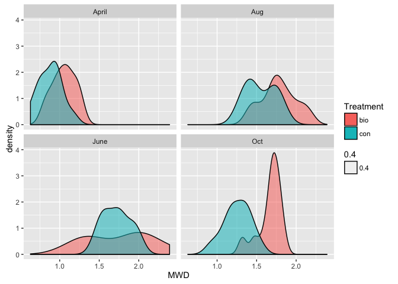
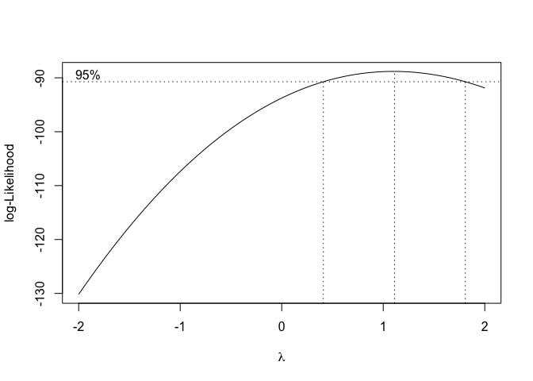

LONG TERM IMPACTS OF BIOSOLIDS ON SOILS
---------------------------------------

### Explore the data

    library("ggplot2")
    library(lme4)
    library(reshape2)
    library(MASS)
    library(dplyr)
    library(base)

    soil<-read.table("MWD.csv", sep = ",", header = T) 
    head(soil)

    ##   Sample  Date Block Treatment Transect  MWD
    ## 1      1 April    b1       bio        1 1.05
    ## 2      2 April    b1       bio        2 0.95
    ## 3      3 April    b1       bio        3 0.99
    ## 4      4 April    b3       bio        1 0.82
    ## 5      5 April    b3       bio        2 0.84
    ## 6      6 April    b3       bio        3 0.96

    str(soil)

    ## 'data.frame':    96 obs. of  6 variables:
    ##  $ Sample   : int  1 2 3 4 5 6 7 8 9 10 ...
    ##  $ Date     : Factor w/ 4 levels "April","Aug",..: 1 1 1 1 1 1 1 1 1 1 ...
    ##  $ Block    : Factor w/ 4 levels "b1","b2","b3",..: 1 1 1 3 3 3 2 2 2 4 ...
    ##  $ Treatment: Factor w/ 2 levels "bio","con": 1 1 1 1 1 1 1 1 1 1 ...
    ##  $ Transect : int  1 2 3 1 2 3 1 2 3 1 ...
    ##  $ MWD      : num  1.05 0.95 0.99 0.82 0.84 0.96 1.11 1.25 1.11 1.23 ...

    with(soil,table(Treatment, Date))

    ##          Date
    ## Treatment April Aug June Oct
    ##       bio    12  12   12  12
    ##       con    12  12   12  12

    group_by(soil,Date,Treatment) %>%
      summarise(mean(MWD))

    ## Source: local data frame [8 x 3]
    ## Groups: Date [?]
    ## 
    ##     Date Treatment `mean(MWD)`
    ##   <fctr>    <fctr>       <dbl>
    ## 1  April       bio    1.051667
    ## 2  April       con    0.880000
    ## 3    Aug       bio    1.780000
    ## 4    Aug       con    1.550833
    ## 5   June       bio    1.741667
    ## 6   June       con    1.718333
    ## 7    Oct       bio    1.667500
    ## 8    Oct       con    1.255833

### Looking and understanding the data

> S550: Great exploratory analysis. But what is the motivation behind
> the qqnorm plot? It might not be required for the model we are using.
> Also, what information does the acf() plot give us?

> S550: Some comments above chunks of code would be useful, to state
> what some of the lesser-known functions do.

    hist(soil$MWD, xlab="MWD", main = "Histogram of MWD")

    ggplot(aes(x=soil$Treatment,y=soil$MWD), data=soil) + geom_boxplot() + labs(y="MWD", x="Treatment", main="Boxplot of MWD for the Two Treatment Groups")

    tapply(soil$MWD, soil$Treatment, mean)

    ##      bio      con 
    ## 1.560208 1.351250

    tapply(soil$MWD, soil$Treatment, sd)

    ##       bio       con 
    ## 0.3874274 0.3616547

    qqnorm(soil$MWD)
    qqline(soil$MWD)

    acf(soil)

    Transect.f<-as.factor(soil$Transect)
    plot.design(MWD~Treatment+Block+Date+Transect.f, data = soil, xlab="Treatment", ylab="MWD")

    ggplot(soil, aes(x = Date, y = MWD, group = Treatment, colour = Treatment)) +
    stat_summary(fun.y="mean", geom = "line") +
    labs(x = "Date", title = "Change in MWD over 4 Sampling Dates")

### Analysis

> S550: Good idea to build up the model in this way. But we can take out
> all the preliminary models when we write the final report.

A simple model to start with:  
- Randomized block design  
- Ignore the transects and repeated measurements for now  
- Treat the data collected from the transects as random samples  
- Assume no block interaction effects

Looking at the data in terms of treatment and block:

    interaction.plot(soil$Treatment, soil$Block, soil$MWD, xlab="Treatment", ylab="MWD", main="Change in MWD over Treatments by Block")

    boxcox(MWD~Block+Treatment, data=soil) # To see if transformation on y is needed

    soil.rbd<-aov(MWD~Block+Treatment, soil)
    summary(soil.rbd)

    ##             Df Sum Sq Mean Sq F value  Pr(>F)   
    ## Block        3  0.720  0.2399   1.749 0.16254   
    ## Treatment    1  1.048  1.0479   7.640 0.00691 **
    ## Residuals   91 12.482  0.1372                   
    ## ---
    ## Signif. codes:  0 '***' 0.001 '**' 0.01 '*' 0.05 '.' 0.1 ' ' 1

    plot(soil.rbd)

Adding Date to the model: \> S550: Is the transformation completely
necessary? How much of a difference does it make in the fit? It makes
the results less intuitive, so perhaps it's best to leave it out unless
the linearity assumption is strongly violated.

    boxcox(MWD~Block+Treatment*Date, data=soil)

    soil.rbd2<-aov(sqrt(MWD)~Block+Treatment*Date, soil)
    summary(soil.rbd2)

    ##                Df Sum Sq Mean Sq F value   Pr(>F)    
    ## Block           3 0.1226  0.0409   6.159 0.000771 ***
    ## Treatment       1 0.1842  0.1842  27.776 1.02e-06 ***
    ## Date            3 1.6443  0.5481  82.639  < 2e-16 ***
    ## Treatment:Date  3 0.0868  0.0289   4.361 0.006610 ** 
    ## Residuals      85 0.5638  0.0066                     
    ## ---
    ## Signif. codes:  0 '***' 0.001 '**' 0.01 '*' 0.05 '.' 0.1 ' ' 1

    plot(soil.rbd2)

Mixed-effects model:

    lmer1.1<-lmer(MWD~Block*Date*Treatment+(1|Transect.f), soil)
    summary(lmer1.1)

    ## Linear mixed model fit by REML ['lmerMod']
    ## Formula: MWD ~ Block * Date * Treatment + (1 | Transect.f)
    ##    Data: soil
    ## 
    ## REML criterion at convergence: -12.7
    ## 
    ## Scaled residuals: 
    ##      Min       1Q   Median       3Q      Max 
    ## -2.94470 -0.43421  0.08463  0.46431  1.96034 
    ## 
    ## Random effects:
    ##  Groups     Name        Variance Std.Dev.
    ##  Transect.f (Intercept) 0.001995 0.04467 
    ##  Residual               0.026700 0.16340 
    ## Number of obs: 96, groups:  Transect.f, 3
    ## 
    ## Fixed effects:
    ##                                Estimate Std. Error t value
    ## (Intercept)                    0.996667   0.097802  10.191
    ## Blockb2                        0.160000   0.133418   1.199
    ## Blockb3                       -0.123333   0.133418  -0.924
    ## Blockb4                        0.183333   0.133418   1.374
    ## DateAug                        0.500000   0.133418   3.748
    ## DateJune                       0.820000   0.133418   6.146
    ## DateOct                        0.696667   0.133418   5.222
    ## Treatmentcon                  -0.056667   0.133418  -0.425
    ## Blockb2:DateAug                0.126667   0.188681   0.671
    ## Blockb3:DateAug                0.543333   0.188681   2.880
    ## Blockb4:DateAug                0.243333   0.188681   1.290
    ## Blockb2:DateJune               0.063333   0.188681   0.336
    ## Blockb3:DateJune              -0.416667   0.188681  -2.208
    ## Blockb4:DateJune              -0.166667   0.188681  -0.883
    ## Blockb2:DateOct               -0.166667   0.188681  -0.883
    ## Blockb3:DateOct               -0.076667   0.188681  -0.406
    ## Blockb4:DateOct               -0.080000   0.188681  -0.424
    ## Blockb2:Treatmentcon          -0.143333   0.188681  -0.760
    ## Blockb3:Treatmentcon          -0.003333   0.188681  -0.018
    ## Blockb4:Treatmentcon          -0.313333   0.188681  -1.661
    ## DateAug:Treatmentcon          -0.066667   0.188681  -0.353
    ## DateJune:Treatmentcon         -0.006667   0.188681  -0.035
    ## DateOct:Treatmentcon          -0.243333   0.188681  -1.290
    ## Blockb2:DateAug:Treatmentcon   0.153333   0.266835   0.575
    ## Blockb3:DateAug:Treatmentcon  -0.390000   0.266835  -1.462
    ## Blockb4:DateAug:Treatmentcon   0.273333   0.266835   1.024
    ## Blockb2:DateJune:Treatmentcon -0.073333   0.266835  -0.275
    ## Blockb3:DateJune:Treatmentcon  0.326667   0.266835   1.224
    ## Blockb4:DateJune:Treatmentcon  0.366667   0.266835   1.374
    ## Blockb2:DateOct:Treatmentcon  -0.080000   0.266835  -0.300
    ## Blockb3:DateOct:Treatmentcon   0.090000   0.266835   0.337
    ## Blockb4:DateOct:Treatmentcon   0.003333   0.266835   0.012

    ## 
    ## Correlation matrix not shown by default, as p = 32 > 12.
    ## Use print(x, correlation=TRUE)  or
    ##   vcov(x)     if you need it

    lmer1.2<-lmer(MWD~Block*Date+(1|Transect.f), soil)
    anova(lmer1.1,lmer1.2)

    ## refitting model(s) with ML (instead of REML)

    ## Data: soil
    ## Models:
    ## lmer1.2: MWD ~ Block * Date + (1 | Transect.f)
    ## lmer1.1: MWD ~ Block * Date * Treatment + (1 | Transect.f)
    ##         Df     AIC    BIC logLik deviance  Chisq Chi Df Pr(>Chisq)    
    ## lmer1.2 18   2.904 49.063 16.548  -33.096                             
    ## lmer1.1 34 -42.640 44.548 55.320 -110.640 77.544     16  4.596e-10 ***
    ## ---
    ## Signif. codes:  0 '***' 0.001 '**' 0.01 '*' 0.05 '.' 0.1 ' ' 1

> S550: The three-way intercation probably won't be necessary when
> choosing the final model. How sure are we that even the two-way
> interaction is necessary? Perhaps we could just do an additive model?

Mixed-effects model with nested factor:

    lmer2.1<-lmer(MWD~Block*Date*Treatment+(1|Treatment:Transect.f), soil)
    summary(lmer2.1)

    ## Linear mixed model fit by REML ['lmerMod']
    ## Formula: MWD ~ Block * Date * Treatment + (1 | Treatment:Transect.f)
    ##    Data: soil
    ## 
    ## REML criterion at convergence: -11.3
    ## 
    ## Scaled residuals: 
    ##      Min       1Q   Median       3Q      Max 
    ## -2.94982 -0.45801  0.07191  0.46131  1.97537 
    ## 
    ## Random effects:
    ##  Groups               Name        Variance Std.Dev.
    ##  Treatment:Transect.f (Intercept) 0.001419 0.03767 
    ##  Residual                         0.027277 0.16516 
    ## Number of obs: 96, groups:  Treatment:Transect.f, 6
    ## 
    ## Fixed effects:
    ##                                Estimate Std. Error t value
    ## (Intercept)                    0.996667   0.097802  10.191
    ## Blockb2                        0.160000   0.134850   1.187
    ## Blockb3                       -0.123333   0.134850  -0.915
    ## Blockb4                        0.183333   0.134850   1.360
    ## DateAug                        0.500000   0.134850   3.708
    ## DateJune                       0.820000   0.134850   6.081
    ## DateOct                        0.696667   0.134850   5.166
    ## Treatmentcon                  -0.056667   0.138313  -0.410
    ## Blockb2:DateAug                0.126667   0.190707   0.664
    ## Blockb3:DateAug                0.543333   0.190707   2.849
    ## Blockb4:DateAug                0.243333   0.190707   1.276
    ## Blockb2:DateJune               0.063333   0.190707   0.332
    ## Blockb3:DateJune              -0.416667   0.190707  -2.185
    ## Blockb4:DateJune              -0.166667   0.190707  -0.874
    ## Blockb2:DateOct               -0.166667   0.190707  -0.874
    ## Blockb3:DateOct               -0.076667   0.190707  -0.402
    ## Blockb4:DateOct               -0.080000   0.190707  -0.419
    ## Blockb2:Treatmentcon          -0.143333   0.190707  -0.752
    ## Blockb3:Treatmentcon          -0.003333   0.190707  -0.017
    ## Blockb4:Treatmentcon          -0.313333   0.190707  -1.643
    ## DateAug:Treatmentcon          -0.066667   0.190707  -0.350
    ## DateJune:Treatmentcon         -0.006667   0.190707  -0.035
    ## DateOct:Treatmentcon          -0.243333   0.190707  -1.276
    ## Blockb2:DateAug:Treatmentcon   0.153333   0.269701   0.569
    ## Blockb3:DateAug:Treatmentcon  -0.390000   0.269701  -1.446
    ## Blockb4:DateAug:Treatmentcon   0.273333   0.269701   1.013
    ## Blockb2:DateJune:Treatmentcon -0.073333   0.269701  -0.272
    ## Blockb3:DateJune:Treatmentcon  0.326667   0.269701   1.211
    ## Blockb4:DateJune:Treatmentcon  0.366667   0.269701   1.360
    ## Blockb2:DateOct:Treatmentcon  -0.080000   0.269701  -0.297
    ## Blockb3:DateOct:Treatmentcon   0.090000   0.269701   0.334
    ## Blockb4:DateOct:Treatmentcon   0.003333   0.269701   0.012

    ## 
    ## Correlation matrix not shown by default, as p = 32 > 12.
    ## Use print(x, correlation=TRUE)  or
    ##   vcov(x)     if you need it

    lmer2.2<-lmer(MWD~Block*Date+(1|Treatment:Transect.f), soil)
    anova(lmer2.1,lmer2.2)

    ## refitting model(s) with ML (instead of REML)

    ## Data: soil
    ## Models:
    ## lmer2.2: MWD ~ Block * Date + (1 | Treatment:Transect.f)
    ## lmer2.1: MWD ~ Block * Date * Treatment + (1 | Treatment:Transect.f)
    ##         Df     AIC    BIC logLik deviance  Chisq Chi Df Pr(>Chisq)    
    ## lmer2.2 18 -15.116 31.043 25.558  -51.116                             
    ## lmer2.1 34 -40.620 46.568 54.310 -108.620 57.504     16   1.37e-06 ***
    ## ---
    ## Signif. codes:  0 '***' 0.001 '**' 0.01 '*' 0.05 '.' 0.1 ' ' 1

Mixed-effects model with nested factor and repeated measurements:  
(I am not sure if I formulate the model I want with correct R syntax. I
am thinking about fixed block effect, fixed treatment effect, random
transect effect, transect factor nested within treatment factor,
transect was measured repeatedly over date.)

    lmer3.1<-lmer(MWD~Block*Date*Treatment+(Date|Treatment:Transect.f), soil)
    summary(lmer3.1)

    ## Linear mixed model fit by REML ['lmerMod']
    ## Formula: MWD ~ Block * Date * Treatment + (Date | Treatment:Transect.f)
    ##    Data: soil
    ## 
    ## REML criterion at convergence: -19.2
    ## 
    ## Scaled residuals: 
    ##      Min       1Q   Median       3Q      Max 
    ## -2.23958 -0.43206  0.06591  0.54342  1.55277 
    ## 
    ## Random effects:
    ##  Groups               Name        Variance  Std.Dev. Corr             
    ##  Treatment:Transect.f (Intercept) 3.959e-06 0.00199                   
    ##                       DateAug     4.139e-03 0.06434   0.68            
    ##                       DateJune    1.918e-02 0.13850   0.62  1.00      
    ##                       DateOct     1.992e-03 0.04464  -1.00 -0.69 -0.63
    ##  Residual                         2.228e-02 0.14926                   
    ## Number of obs: 96, groups:  Treatment:Transect.f, 6
    ## 
    ## Fixed effects:
    ##                                Estimate Std. Error t value
    ## (Intercept)                    0.996667   0.086182  11.565
    ## Blockb2                        0.160000   0.121869   1.313
    ## Blockb3                       -0.123333   0.121869  -1.012
    ## Blockb4                        0.183333   0.121869   1.504
    ## DateAug                        0.500000   0.127403   3.925
    ## DateJune                       0.820000   0.145761   5.626
    ## DateOct                        0.696667   0.124564   5.593
    ## Treatmentcon                  -0.056667   0.121879  -0.465
    ## Blockb2:DateAug                0.126667   0.172348   0.735
    ## Blockb3:DateAug                0.543333   0.172348   3.153
    ## Blockb4:DateAug                0.243333   0.172348   1.412
    ## Blockb2:DateJune               0.063333   0.172348   0.367
    ## Blockb3:DateJune              -0.416667   0.172348  -2.418
    ## Blockb4:DateJune              -0.166667   0.172348  -0.967
    ## Blockb2:DateOct               -0.166667   0.172348  -0.967
    ## Blockb3:DateOct               -0.076667   0.172348  -0.445
    ## Blockb4:DateOct               -0.080000   0.172348  -0.464
    ## Blockb2:Treatmentcon          -0.143333   0.172348  -0.832
    ## Blockb3:Treatmentcon          -0.003333   0.172348  -0.019
    ## Blockb4:Treatmentcon          -0.313333   0.172348  -1.818
    ## DateAug:Treatmentcon          -0.066667   0.180176  -0.370
    ## DateJune:Treatmentcon         -0.006667   0.206137  -0.032
    ## DateOct:Treatmentcon          -0.243333   0.176160  -1.381
    ## Blockb2:DateAug:Treatmentcon   0.153333   0.243737   0.629
    ## Blockb3:DateAug:Treatmentcon  -0.390000   0.243737  -1.600
    ## Blockb4:DateAug:Treatmentcon   0.273333   0.243737   1.121
    ## Blockb2:DateJune:Treatmentcon -0.073333   0.243737  -0.301
    ## Blockb3:DateJune:Treatmentcon  0.326667   0.243737   1.340
    ## Blockb4:DateJune:Treatmentcon  0.366667   0.243737   1.504
    ## Blockb2:DateOct:Treatmentcon  -0.080000   0.243737  -0.328
    ## Blockb3:DateOct:Treatmentcon   0.090000   0.243737   0.369
    ## Blockb4:DateOct:Treatmentcon   0.003333   0.243737   0.014

    ## 
    ## Correlation matrix not shown by default, as p = 32 > 12.
    ## Use print(x, correlation=TRUE)  or
    ##   vcov(x)     if you need it

    lmer3.2<-lmer(MWD~Block*Date+(Date|Treatment:Transect.f), soil)
    anova(lmer3.1,lmer3.2)

    ## refitting model(s) with ML (instead of REML)

    ## Data: soil
    ## Models:
    ## lmer3.2: MWD ~ Block * Date + (Date | Treatment:Transect.f)
    ## lmer3.1: MWD ~ Block * Date * Treatment + (Date | Treatment:Transect.f)
    ##         Df     AIC    BIC logLik deviance  Chisq Chi Df Pr(>Chisq)    
    ## lmer3.2 27 -13.792 55.445 33.896  -67.792                             
    ## lmer3.1 43 -34.516 75.751 60.258 -120.516 52.723     16  8.367e-06 ***
    ## ---
    ## Signif. codes:  0 '***' 0.001 '**' 0.01 '*' 0.05 '.' 0.1 ' ' 1

LONG TERM IMPACTS OF BIOSOLIDS ON PLANT COVER
---------------------------------------------

### Data Exploration

    pc <- read.csv("plant_cover.csv", header = T)
    attach(pc)
    str(pc)

    ## 'data.frame':    2669 obs. of  9 variables:
    ##  $ Project    : Factor w/ 1 level "OK Ranch Biosolids Resample": 1 1 1 1 1 1 1 1 1 1 ...
    ##  $ Date       : Factor w/ 2 levels "June 21, 2016",..: 1 1 1 1 1 1 1 1 1 1 ...
    ##  $ Block      : int  1 1 1 1 1 1 1 1 1 1 ...
    ##  $ Treatment  : Factor w/ 2 levels "Biosolids","Control": 1 1 1 1 1 1 1 1 1 1 ...
    ##  $ Transect   : int  1 1 1 1 1 1 1 1 1 1 ...
    ##  $ Plot       : int  2 2 2 2 2 2 2 2 2 3 ...
    ##  $ Species    : Factor w/ 50 levels "ACMI","ACRI",..: 1 3 9 11 29 33 39 47 48 3 ...
    ##  $ Cover.class: int  1 1 1 2 4 5 3 3 1 2 ...
    ##  $ Cover.value: num  2.5 2.5 2.5 15 62.5 85 37.5 37.5 2.5 15 ...

    Block.f <- as.factor(Block)
    Transect.f <- as.factor(Transect)

    group_by(pc,Block,Treatment) %>%
      summarise(mean(Cover.value), sd(Cover.value))

    ## Source: local data frame [8 x 4]
    ## Groups: Block [?]
    ## 
    ##   Block Treatment `mean(Cover.value)` `sd(Cover.value)`
    ##   <int>    <fctr>               <dbl>             <dbl>
    ## 1     1 Biosolids            32.70764          35.28365
    ## 2     1   Control            17.30952          18.18493
    ## 3     2 Biosolids            28.90365          32.73254
    ## 4     2   Control            15.17857          17.42308
    ## 5     3 Biosolids            40.47071          38.97941
    ## 6     3   Control            21.96884          23.51373
    ## 7     4 Biosolids            33.51124          36.84526
    ## 8     4   Control            16.77356          20.23028

    ggplot(aes(x = Block, y = Cover.value, group = Treatment, colour = Treatment), data = pc)+stat_summary(fun.y="mean", geom = "line")+labs(x = "Block", y = "Plant Cover Value", title = "Change in Cover Value over Different Blocks")

    ggplot(aes(x = Block, y = Cover.class, group = Treatment, colour = Treatment), data = pc)+stat_summary(fun.y="mean", geom = "line")+labs(x = "Block", y = "Plant Cover Class", title = "Change in Cover Class over Different Blocks")

    # From the plots above we can see Cover Class and Cover Value are almost the same in terms of changes with Treatment and within Blocks. We use Cover Value because it is closer to a continuous variable.

### Diagnostics: checking assumptions of linear models

    plot(Treatment, Cover.value)

    # similar variability of cover value within two levels of treatment although strange behaviour of Control group

    qqnorm(Cover.value)

    # strange behaviour due to the fact that cover value is discrete
    hist(Cover.value)

    # not quite normal, heavy right tail

    # I tried the following transformations to reduce right skewness but it does not seem to work well. I continued with non-transfromed response value in the analysis below, but this should be a concern?
    hist(1/Cover.value)

    Cover.value.log <- log(Cover.value)
    hist(Cover.value.log)

    Cover.value.sqrt <- sqrt(Cover.value)
    hist(Cover.value.sqrt)

    pc_sub <- pc[ ,c(3,4,5,9)]
    acf(pc_sub)

    # no multicolinearity within explnatory variables

    # Residuals are checked in the next section after imposing each linear model.

### Analysis

1.  Model 1: all explanatory variables are fixed categorical variables

<!-- -->

    model1 <- aov(Cover.value ~ Block.f * Treatment * Transect.f)
    summary(model1)

    ##                                Df  Sum Sq Mean Sq F value   Pr(>F)    
    ## Block.f                         3   23718    7906  10.510 7.18e-07 ***
    ## Treatment                       1  165012  165012 219.362  < 2e-16 ***
    ## Transect.f                      4   13092    3273   4.351  0.00165 ** 
    ## Block.f:Treatment               3    1930     643   0.855  0.46370    
    ## Block.f:Transect.f             12   15241    1270   1.688  0.06300 .  
    ## Treatment:Transect.f            4    5457    1364   1.814  0.12340    
    ## Block.f:Treatment:Transect.f   12   18280    1523   2.025  0.01889 *  
    ## Residuals                    2629 1977624     752                     
    ## ---
    ## Signif. codes:  0 '***' 0.001 '**' 0.01 '*' 0.05 '.' 0.1 ' ' 1

    plot(resid(model1))

    # lm output for comparing each level
    summary(lm(Cover.value ~ Treatment*Block.f*Transect.f))

    ## 
    ## Call:
    ## lm(formula = Cover.value ~ Treatment * Block.f * Transect.f)
    ## 
    ## Residuals:
    ##     Min      1Q  Median      3Q     Max 
    ## -50.139 -17.222  -7.857  15.634  74.423 
    ## 
    ## Coefficients:
    ##                                       Estimate Std. Error t value Pr(>|t|)
    ## (Intercept)                            30.6439     3.3760   9.077  < 2e-16
    ## TreatmentControl                      -15.8164     4.4770  -3.533 0.000418
    ## Block.f2                               -5.9051     4.7566  -1.241 0.214542
    ## Block.f3                                7.5968     5.0327   1.509 0.131292
    ## Block.f4                               -5.9848     4.7744  -1.254 0.210126
    ## Transect.f2                             1.4714     5.0856   0.289 0.772348
    ## Transect.f3                             1.1593     4.8713   0.238 0.811903
    ## Transect.f4                             6.7245     4.9593   1.356 0.175236
    ## Transect.f5                             1.3945     4.7927   0.291 0.771100
    ## TreatmentControl:Block.f2               9.6165     6.4063   1.501 0.133449
    ## TreatmentControl:Block.f3              -1.3133     6.6650  -0.197 0.843810
    ## TreatmentControl:Block.f4               5.2346     6.3558   0.824 0.410243
    ## TreatmentControl:Transect.f2            3.1837     6.5693   0.485 0.627976
    ## TreatmentControl:Transect.f3            2.5425     6.4207   0.396 0.692150
    ## TreatmentControl:Transect.f4           -6.3713     6.5042  -0.980 0.327383
    ## TreatmentControl:Transect.f5            2.3676     6.4235   0.369 0.712461
    ## Block.f2:Transect.f2                    7.5633     7.1613   1.056 0.291000
    ## Block.f3:Transect.f2                   -3.2122     7.4053  -0.434 0.664492
    ## Block.f4:Transect.f2                   26.5084     7.6260   3.476 0.000517
    ## Block.f2:Transect.f3                   -2.8212     6.6784  -0.422 0.672737
    ## Block.f3:Transect.f3                    8.2828     7.4838   1.107 0.268492
    ## Block.f4:Transect.f3                   15.1191     7.1273   2.121 0.033990
    ## Block.f2:Transect.f4                    0.4812     7.0535   0.068 0.945620
    ## Block.f3:Transect.f4                   -8.7407     7.3401  -1.191 0.233830
    ## Block.f4:Transect.f4                   -1.4729     7.0303  -0.210 0.834073
    ## Block.f2:Transect.f5                    9.1218     7.0391   1.296 0.195135
    ## Block.f3:Transect.f5                    5.9758     7.3224   0.816 0.414511
    ## Block.f4:Transect.f5                    3.2087     6.8337   0.470 0.638724
    ## TreatmentControl:Block.f2:Transect.f2 -16.2180     9.3938  -1.726 0.084383
    ## TreatmentControl:Block.f3:Transect.f2   2.5888     9.6605   0.268 0.788740
    ## TreatmentControl:Block.f4:Transect.f2 -25.5187     9.8155  -2.600 0.009379
    ## TreatmentControl:Block.f2:Transect.f3  -3.3902     8.9842  -0.377 0.705947
    ## TreatmentControl:Block.f3:Transect.f3 -11.2296     9.7234  -1.155 0.248237
    ## TreatmentControl:Block.f4:Transect.f3 -13.2420     9.3087  -1.423 0.154989
    ## TreatmentControl:Block.f2:Transect.f4  -9.1407     9.2724  -0.986 0.324325
    ## TreatmentControl:Block.f3:Transect.f4   4.5738     9.6020   0.476 0.633875
    ## TreatmentControl:Block.f4:Transect.f4  -2.6005     9.2220  -0.282 0.777972
    ## TreatmentControl:Block.f2:Transect.f5 -14.5022     9.3157  -1.557 0.119653
    ## TreatmentControl:Block.f3:Transect.f5  -5.9628     9.6826  -0.616 0.538065
    ## TreatmentControl:Block.f4:Transect.f5   0.6419     9.1946   0.070 0.944346
    ##                                          
    ## (Intercept)                           ***
    ## TreatmentControl                      ***
    ## Block.f2                                 
    ## Block.f3                                 
    ## Block.f4                                 
    ## Transect.f2                              
    ## Transect.f3                              
    ## Transect.f4                              
    ## Transect.f5                              
    ## TreatmentControl:Block.f2                
    ## TreatmentControl:Block.f3                
    ## TreatmentControl:Block.f4                
    ## TreatmentControl:Transect.f2             
    ## TreatmentControl:Transect.f3             
    ## TreatmentControl:Transect.f4             
    ## TreatmentControl:Transect.f5             
    ## Block.f2:Transect.f2                     
    ## Block.f3:Transect.f2                     
    ## Block.f4:Transect.f2                  ***
    ## Block.f2:Transect.f3                     
    ## Block.f3:Transect.f3                     
    ## Block.f4:Transect.f3                  *  
    ## Block.f2:Transect.f4                     
    ## Block.f3:Transect.f4                     
    ## Block.f4:Transect.f4                     
    ## Block.f2:Transect.f5                     
    ## Block.f3:Transect.f5                     
    ## Block.f4:Transect.f5                     
    ## TreatmentControl:Block.f2:Transect.f2 .  
    ## TreatmentControl:Block.f3:Transect.f2    
    ## TreatmentControl:Block.f4:Transect.f2 ** 
    ## TreatmentControl:Block.f2:Transect.f3    
    ## TreatmentControl:Block.f3:Transect.f3    
    ## TreatmentControl:Block.f4:Transect.f3    
    ## TreatmentControl:Block.f2:Transect.f4    
    ## TreatmentControl:Block.f3:Transect.f4    
    ## TreatmentControl:Block.f4:Transect.f4    
    ## TreatmentControl:Block.f2:Transect.f5    
    ## TreatmentControl:Block.f3:Transect.f5    
    ## TreatmentControl:Block.f4:Transect.f5    
    ## ---
    ## Signif. codes:  0 '***' 0.001 '**' 0.01 '*' 0.05 '.' 0.1 ' ' 1
    ## 
    ## Residual standard error: 27.43 on 2629 degrees of freedom
    ## Multiple R-squared:  0.1093, Adjusted R-squared:  0.09611 
    ## F-statistic: 8.274 on 39 and 2629 DF,  p-value: < 2.2e-16

Comment: Treatment effect seems to be significant. Sum of squares for
residuals is very large, indicating a lot of variation is unexplained
and the significance of treatment might not be true. No obvious pattern
from residual plot.

1.  Model 2: Transect is now a random effect, Block and Treatment are
    fixed effects

<!-- -->

    model2.1 <- lmer(Cover.value ~ Treatment+Block.f+(1|Transect.f))
    summary(model2.1)

    ## Linear mixed model fit by REML ['lmerMod']
    ## Formula: Cover.value ~ Treatment + Block.f + (1 | Transect.f)
    ## 
    ## REML criterion at convergence: 25265.5
    ## 
    ## Scaled residuals: 
    ##     Min      1Q  Median      3Q     Max 
    ## -1.3959 -0.6684 -0.3493  0.5009  2.6492 
    ## 
    ## Random effects:
    ##  Groups     Name        Variance Std.Dev.
    ##  Transect.f (Intercept)   4.732   2.175  
    ##  Residual               758.847  27.547  
    ## Number of obs: 2669, groups:  Transect.f, 5
    ## 
    ## Fixed effects:
    ##                  Estimate Std. Error t value
    ## (Intercept)       33.0811     1.5484  21.364
    ## TreatmentControl -15.9949     1.0828 -14.771
    ## Block.f2          -2.8358     1.4585  -1.944
    ## Block.f3           5.9566     1.5281   3.898
    ## Block.f4           0.1742     1.4915   0.117
    ## 
    ## Correlation of Fixed Effects:
    ##             (Intr) TrtmnC Blck.2 Blck.3
    ## TrtmntCntrl -0.408                     
    ## Block.f2    -0.469  0.006              
    ## Block.f3    -0.441 -0.009  0.472       
    ## Block.f4    -0.453 -0.005  0.484  0.462

    model2.2 <- lmer(Cover.value ~ 1+Block+(1|Transect.f))
    anova(model2.2, model2.1)

    ## refitting model(s) with ML (instead of REML)

    ## Data: NULL
    ## Models:
    ## model2.2: Cover.value ~ 1 + Block + (1 | Transect.f)
    ## model2.1: Cover.value ~ Treatment + Block.f + (1 | Transect.f)
    ##          Df   AIC   BIC logLik deviance  Chisq Chi Df Pr(>Chisq)    
    ## model2.2  4 25521 25544 -12756    25513                             
    ## model2.1  7 25291 25332 -12638    25277 236.01      3  < 2.2e-16 ***
    ## ---
    ## Signif. codes:  0 '***' 0.001 '**' 0.01 '*' 0.05 '.' 0.1 ' ' 1

Comment: Treatment effect is still significant at the same significance
level. From the lm output, A small proportion of randomness is explained
by Transect effects but variance of residuals is still quite large. The
residuals seem to be centered at 0 from the summary of lm output: scaled
residuals.

Question: I did not use aov() because I am not sure how to read summary
of aov output properly when there are three explanatory variables. It
contains strange behaviours. Not sure if aov output would be more useful
here.

1.  Model 3: Mixed effects models with nested structure

<!-- -->

    model3.1 <- lmer(Cover.value ~ Treatment+Block.f+(1|Treatment:Transect.f))
    summary(model3.1)

    ## Linear mixed model fit by REML ['lmerMod']
    ## Formula: Cover.value ~ Treatment + Block.f + (1 | Treatment:Transect.f)
    ## 
    ## REML criterion at convergence: 25265.2
    ## 
    ## Scaled residuals: 
    ##     Min      1Q  Median      3Q     Max 
    ## -1.4073 -0.6588 -0.3369  0.4951  2.6599 
    ## 
    ## Random effects:
    ##  Groups               Name        Variance Std.Dev.
    ##  Treatment:Transect.f (Intercept)   5.81    2.41   
    ##  Residual                         757.88   27.53   
    ## Number of obs: 2669, groups:  Treatment:Transect.f, 10
    ## 
    ## Fixed effects:
    ##                  Estimate Std. Error t value
    ## (Intercept)       33.1354     1.6167  20.496
    ## TreatmentControl -16.0446     1.8703  -8.579
    ## Block.f2          -2.8226     1.4582  -1.936
    ## Block.f3           5.9340     1.5274   3.885
    ## Block.f4           0.1608     1.4905   0.108
    ## 
    ## Correlation of Fixed Effects:
    ##             (Intr) TrtmnC Blck.2 Blck.3
    ## TrtmntCntrl -0.611                     
    ## Block.f2    -0.448  0.003              
    ## Block.f3    -0.422 -0.005  0.472       
    ## Block.f4    -0.434 -0.003  0.483  0.462

    model3.2 <- lmer(Cover.value ~ 1+Block.f+(1|Treatment:Transect.f))
    anova(model3.1, model3.2)

    ## refitting model(s) with ML (instead of REML)

    ## Data: NULL
    ## Models:
    ## model3.2: Cover.value ~ 1 + Block.f + (1 | Treatment:Transect.f)
    ## model3.1: Cover.value ~ Treatment + Block.f + (1 | Treatment:Transect.f)
    ##          Df   AIC   BIC logLik deviance  Chisq Chi Df Pr(>Chisq)    
    ## model3.2  6 25312 25348 -12650    25300                             
    ## model3.1  7 25291 25332 -12638    25277 23.351      1   1.35e-06 ***
    ## ---
    ## Signif. codes:  0 '***' 0.001 '**' 0.01 '*' 0.05 '.' 0.1 ' ' 1

Comment: Treatment is still a significant factor in this mixed effect
nested model. Same as before, residual variance is still large.

1.  Quick comment on Ordinal regression model to incorporate that
    Cover.value is a discrete dependent variable

<!-- -->

    Cover.value.f <- as.factor(Cover.value)
    model4.1 <- polr(Cover.value.f ~ Treatment+Block.f+Transect.f, Hess = T)
    summary(model4.1)

    ## Call:
    ## polr(formula = Cover.value.f ~ Treatment + Block.f + Transect.f, 
    ##     Hess = T)
    ## 
    ## Coefficients:
    ##                     Value Std. Error t value
    ## TreatmentControl -0.67723    0.07363 -9.1982
    ## Block.f2         -0.23166    0.09637 -2.4038
    ## Block.f3          0.26133    0.10120  2.5822
    ## Block.f4         -0.13363    0.09949 -1.3431
    ## Transect.f2       0.26082    0.11254  2.3175
    ## Transect.f3       0.06672    0.11030  0.6048
    ## Transect.f4      -0.01693    0.10840 -0.1561
    ## Transect.f5       0.15782    0.11157  1.4145
    ## 
    ## Intercepts:
    ##           Value   Std. Error t value
    ## 2.5|15    -0.7715  0.1067    -7.2284
    ## 15|37.5    0.4618  0.1065     4.3349
    ## 37.5|62.5  1.2317  0.1101    11.1838
    ## 62.5|85    1.7974  0.1155    15.5646
    ## 85|97.5    2.4489  0.1263    19.3945
    ## 
    ## Residual Deviance: 7801.593 
    ## AIC: 7827.593

    model4.2 <- polr(Cover.value.f ~ 1+Block.f+Transect.f, Hess = T)
    anova(model4.1, model4.2)

    ## Likelihood ratio tests of ordinal regression models
    ## 
    ## Response: Cover.value.f
    ##                              Model Resid. df Resid. Dev   Test    Df
    ## 1         1 + Block.f + Transect.f      2657   7886.782             
    ## 2 Treatment + Block.f + Transect.f      2656   7801.593 1 vs 2     1
    ##   LR stat. Pr(Chi)
    ## 1                 
    ## 2 85.18841       0

I tried to include random effects in ordinal regression model but polr()
does not recognize the same syntax as above. In addition I get confused
when comparing two ordinal regression models as anova() shows a p-value
of 0. I think we should discuss whether it is enough to assume that
Cover.value is contineous before exploring more about ordinal
regression?

    detach(pc)

### Correlation between Plant Cover and MWD

    pc.corr <- melt(tapply(pc$Cover.value, pc$Block, mean))
    soil.june <- soil %>%
      filter(Date == "June")
    soil.corr <- melt(tapply(soil.june$MWD, soil.june$Block, mean))
    cor(pc.corr[2], soil.corr[2])

    ##            value
    ## value -0.9843717

MWD and Plant Cover Value seem to have a strong negative correlation
which is strange because we expect to see at least a positive
correlation. The problem is that the two variable, MWD and Cover Value,
do not have the same length. MWD is measured in 4 months and is
calculated as an average of 3 transects. Cover Value is measured only
once in June and is calculated as an average of 5 transects. In the code
above, I simply take all average within blocks (4 measurements for each
MWD and plant cover data) and take only June measurements from MWD data.
We should fix this issue soon in next steps.

### Modified model after talking with Professor

A simple model to start with:  
- Randomized complete block design (but block effect as random)  
- Ignore the transects and repeated measurements for now  
- Treat the transects as pseudo-replication

    soil.rcb1<-lmer(MWD~Treatment+(1|Block), soil)
    summary(soil.rcb1)

    ## Linear mixed model fit by REML ['lmerMod']
    ## Formula: MWD ~ Treatment + (1 | Block)
    ##    Data: soil
    ## 
    ## REML criterion at convergence: 89.4
    ## 
    ## Scaled residuals: 
    ##     Min      1Q  Median      3Q     Max 
    ## -1.8460 -0.8817  0.1860  0.6827  2.1580 
    ## 
    ## Random effects:
    ##  Groups   Name        Variance Std.Dev.
    ##  Block    (Intercept) 0.004282 0.06544 
    ##  Residual             0.137167 0.37036 
    ## Number of obs: 96, groups:  Block, 4
    ## 
    ## Fixed effects:
    ##              Estimate Std. Error t value
    ## (Intercept)   1.56021    0.06268  24.894
    ## Treatmentcon -0.20896    0.07560  -2.764
    ## 
    ## Correlation of Fixed Effects:
    ##             (Intr)
    ## Treatmentcn -0.603

    plot(soil.rcb1)

    soil.rcb2<-lmer(MWD~1+(1|Block), soil)
    summary(soil.rcb2)

    ## Linear mixed model fit by REML ['lmerMod']
    ## Formula: MWD ~ 1 + (1 | Block)
    ##    Data: soil
    ## 
    ## REML criterion at convergence: 93.5
    ## 
    ## Scaled residuals: 
    ##     Min      1Q  Median      3Q     Max 
    ## -2.0288 -0.7462  0.1153  0.7449  2.3642 
    ## 
    ## Random effects:
    ##  Groups   Name        Variance Std.Dev.
    ##  Block    (Intercept) 0.00387  0.06221 
    ##  Residual             0.14707  0.38349 
    ## Number of obs: 96, groups:  Block, 4
    ## 
    ## Fixed effects:
    ##             Estimate Std. Error t value
    ## (Intercept)  1.45573    0.04999   29.12

    anova(soil.rcb1,soil.rcb2)

    ## refitting model(s) with ML (instead of REML)

    ## Data: soil
    ## Models:
    ## soil.rcb2: MWD ~ 1 + (1 | Block)
    ## soil.rcb1: MWD ~ Treatment + (1 | Block)
    ##           Df    AIC    BIC  logLik deviance  Chisq Chi Df Pr(>Chisq)   
    ## soil.rcb2  3 95.224 102.92 -44.612   89.224                            
    ## soil.rcb1  4 89.807 100.06 -40.904   81.807 7.4166      1   0.006463 **
    ## ---
    ## Signif. codes:  0 '***' 0.001 '**' 0.01 '*' 0.05 '.' 0.1 ' ' 1

Add Date to the model

    soil.date1<-lmer(MWD~Treatment*Date+(1|Block), soil)
    summary(soil.date1)

    ## Linear mixed model fit by REML ['lmerMod']
    ## Formula: MWD ~ Treatment * Date + (1 | Block)
    ##    Data: soil
    ## 
    ## REML criterion at convergence: -8.4
    ## 
    ## Scaled residuals: 
    ##     Min      1Q  Median      3Q     Max 
    ## -2.6096 -0.5821 -0.0017  0.6172  2.9457 
    ## 
    ## Random effects:
    ##  Groups   Name        Variance Std.Dev.
    ##  Block    (Intercept) 0.008332 0.09128 
    ##  Residual             0.039961 0.19990 
    ## Number of obs: 96, groups:  Block, 4
    ## 
    ## Fixed effects:
    ##                       Estimate Std. Error t value
    ## (Intercept)            1.05167    0.07357  14.294
    ## Treatmentcon          -0.17167    0.08161  -2.104
    ## DateAug                0.72833    0.08161   8.925
    ## DateJune               0.69000    0.08161   8.455
    ## DateOct                0.61583    0.08161   7.546
    ## Treatmentcon:DateAug  -0.05750    0.11541  -0.498
    ## Treatmentcon:DateJune  0.14833    0.11541   1.285
    ## Treatmentcon:DateOct  -0.24000    0.11541  -2.079
    ## 
    ## Correlation of Fixed Effects:
    ##             (Intr) Trtmnt DateAg DateJn DatOct Trt:DA Trt:DJ
    ## Treatmentcn -0.555                                          
    ## DateAug     -0.555  0.500                                   
    ## DateJune    -0.555  0.500  0.500                            
    ## DateOct     -0.555  0.500  0.500  0.500                     
    ## Trtmntcn:DA  0.392 -0.707 -0.707 -0.354 -0.354              
    ## Trtmntcn:DJ  0.392 -0.707 -0.354 -0.707 -0.354  0.500       
    ## Trtmntcn:DO  0.392 -0.707 -0.354 -0.354 -0.707  0.500  0.500

    plot(soil.date1)

    soil.date2<-lmer(MWD~Treatment+Date+(1|Block), soil)
    summary(soil.date2)

    ## Linear mixed model fit by REML ['lmerMod']
    ## Formula: MWD ~ Treatment + Date + (1 | Block)
    ##    Data: soil
    ## 
    ## REML criterion at convergence: -5.3
    ## 
    ## Scaled residuals: 
    ##     Min      1Q  Median      3Q     Max 
    ## -2.9440 -0.5482  0.0974  0.6313  2.3773 
    ## 
    ## Random effects:
    ##  Groups   Name        Variance Std.Dev.
    ##  Block    (Intercept) 0.008169 0.09038 
    ##  Residual             0.043872 0.20946 
    ## Number of obs: 96, groups:  Block, 4
    ## 
    ## Fixed effects:
    ##              Estimate Std. Error t value
    ## (Intercept)   1.07031    0.06578  16.270
    ## Treatmentcon -0.20896    0.04276  -4.887
    ## DateAug       0.69958    0.06047  11.570
    ## DateJune      0.76417    0.06047  12.638
    ## DateOct       0.49583    0.06047   8.200
    ## 
    ## Correlation of Fixed Effects:
    ##             (Intr) Trtmnt DateAg DateJn
    ## Treatmentcn -0.325                     
    ## DateAug     -0.460  0.000              
    ## DateJune    -0.460  0.000  0.500       
    ## DateOct     -0.460  0.000  0.500  0.500

    plot(soil.date2)

    anova(soil.date1,soil.date2)

    ## refitting model(s) with ML (instead of REML)

    ## Data: soil
    ## Models:
    ## soil.date2: MWD ~ Treatment + Date + (1 | Block)
    ## soil.date1: MWD ~ Treatment * Date + (1 | Block)
    ##            Df     AIC    BIC logLik deviance  Chisq Chi Df Pr(>Chisq)   
    ## soil.date2  7 -12.149 5.8017 13.074  -26.149                            
    ## soil.date1 10 -17.931 7.7128 18.965  -37.931 11.782      3   0.008169 **
    ## ---
    ## Signif. codes:  0 '***' 0.001 '**' 0.01 '*' 0.05 '.' 0.1 ' ' 1
