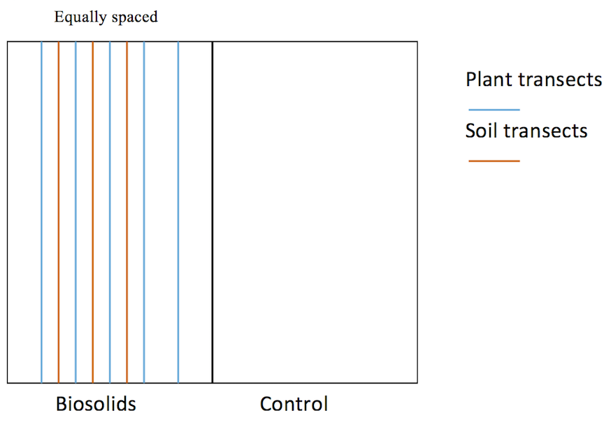

####Experimental design 
- Randomized block design with 4 blocks, 2 treatments in each block (biosolids vs control), 5 transects for plant species assessment and 3 transects for aggregate stability investigation within each treatment. Transects are equally spaced.
- Half of one block = 1 experimental unit.
- Pseudo replication within each experimental unit.

####Data collection
- Data on aggregate stability, measured by Mean Weight Diameter (MWD), was collected four times over the growing season (April, June, August and October). Larger MWD means that the soil is more stable/better. The total number of samples taken are 96 (4 sampling dates * 4 blocks * 2 treatments * 3 transects * 1 composite sample per transect). There exist repeated measurements of MWD from roughly the same place over the four dates.
- Data on plant composition, measured by cover value (categorical), was collected only one time (June). The total number of samples taken are  400 (4 blocks * 2 treatments * 5 transects * 10 samples per transect).

####Questions of interest
- Impact of 1) treatment and 2) date on MWD and individual size fractions.
- Correlation between biosolids treatment (aggregate stability) and plant species composition (individual plant and overall effect).

####Further information and questions
- No obvious difference across the four blocks: the blocks are purposely chosen so that they share similar characteristics (2 blocks are on higher altitude).
- Plant cover value: categorical variable with level from 1 to 6, with each level representing a percentage range.
- There is a list of specifically interested plant species.
- Size fraction: percentage of aggregates within range (6-2mm, 1- 2mm, and 1-0.25mm). The lab analysis was run on different size fractions separately.
- For the soil data, a composite is the combination of 7 soil samples along each transect. Loss of information? Variance of subsamples unknown (problem?).
- Whether the researchers are interested in block effects or not (random effect vs fixed effect).