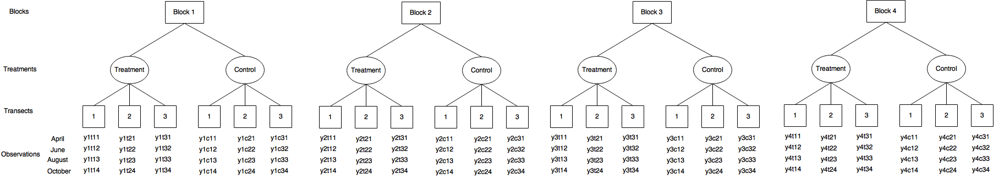

## Introduction

A randomized complete block design was conducted to examine the long term impacts of biosolids application on grassland plant communities and soil health in 2002 at the OK Ranch, Jesmond, BC. This experimental design had two treatment replicated in each of four blocks: (i) single application of biosolids at 20 dry Mg ha-1 and (ii) no biosolids (control). 

One objective of this study is to investigate whether the single biosolids application contribution to overall improved soil structure by providing a food source for microbial activity and forming soil aggregates. This improvements to soil structure can increase the water and nutrient holding capacity of the soil. To examine the presence of the weighted average size of stable aggregate in the soil, mean weighted diameter (MWD) of aggregates was considered as a parameter. The larger MWD value means the larger stable aggregates of soil structure. So we have to analyze whether the treatment and sampling date has an impact on the aggregate MWD and individuals aggregate size fractions (6-2mm, 1-2mm, and 1-0.25mm)

Another objective of this study is to examine the correlations between plant species composition and aggregate stability. Plant species composition is the visual assessment of percent covered by species, as well as percent cover of exposed soil and microbiotic crust. So it would be enough if we can prove any statistical correlation between plant cover (or lack thereof) and aggregate stability.

## Data collection and sampling process

The experiment was started at 2002 and since then plant species composition data was been collected for 5 consecutive years (2002-2006) and was sampled again in 2016. Plant species composition data was collected only once per year, in the summer (June/July). But the soil data was only been collected 4 times over the growing season (April, June, August and October) in one year (2016).

To take sample appropriately each block was divided in half to form the experimental units, and one treatment was applied to each half. Five 50-m-long transects were systematically arranged to provide balanced coverage within each experimental unit. Ten sample plant were sampled (0.2 by 0.5 m) from each of the transects to investigate the visual estimates of plant cover in total of 50 plots in one trransects. So the total number of vegetation assessments taken annually was 400 (4 blocks × 2 treatments × 5 transects × 10 samples per transect).

For the soil sampling, three 50-m-long transects place between the plant transects in each experimental unit. A subsample was composited from each transect by combining 7 soil samples from every 7m along the transect. The total number of soil samples collected in 2016 was 96 (4 sampling dates x 4 blocks x 2 treatments x 3 transects x 1 composite sample per transect). Furthermore, the lab analysis was run on 3 different size fractions of the soil samples (soil aggregates of 6-2mm, 1- 2mm, and 1-0.25mm). 

## Brief proposal of the analysis

Three analysis steps will be conducted, using similar models but focusing on different response variables.

In the first analysis, conducted by the STAT 450 students, the question of interest is whether aggregate stability is affected by the fertilizer treatment (biosolids or control). Analysis of Variance is our main approach to answer this question. The response variable is MWD, a measure of soil quality. Treatment is a factor with two levels (biosolids and control) and will be modeled as a fixed effect. A further factor in the model will be the time of measurement over the growing season (April, June, August or October), since this is also of interest to the researcher. The data will be analyzed using a mixed-effects linear model with a fixed block effect. The variation between transects will be captured by a random transect effect in the model. The researchers' idea is to get a singel value from each composite, so the variation within transects will be taken care of by the random error term instead of being modeled explicitly. If we treat "transect" as a factor which has three levels (transect 1, 2 and 3), then it is a nested factor under the treatment factor. Moreover, there are four measurements on each transect. The diagram below illustrates this point:

yijkl represents the MWD measurement from block i (1, 2, 3, 4), treatment j (t, c), transect k (1, 2, 3) and time l (1, 2, 3, 4). 

The second analysis, conducted by the STAT 550 students, focuses on how the plant species composition is affected by the fertilizer treatment. The response values of interest will be the cover values for each of several plant species. These values are obtained by determining the cover class for each plant species within each plot (based on what percentage of the plot is taken up by the plant), and then converting these classes to the midpoint of an interval of percentages. We will not consider dates for this study, since all the measurements are taken in June 2016. Similar to the previous question, we will analyze the data using a mixed-effects linear model with a random effect for transects. Block effect would be considered fixed because the researcher believes there is considerable sources of variation due to the natural differences in lands. The experimental design has 10 subsamples for each plant-transects, but we will not consider any random effects at the subsample level because these data are aggregated into an average of a whole plant-transect. There are three special issues: 1) the visial assesment of percentage coverage is conducted with almost the same spot each time (repeated measurements) 2) measurements on five plant transects within each experimental unit (half of block) are considered pseudo replications and 3)cover value for plant sepcies (response variable) is categorical. The first two will be handled by a random effect for transects. We will use ordinal regression model to take care of categorical response variable as the difference between each category (cover value) is constant.

Finally, in a third but simple analysis step, correlations will be obtained between MWD and cover value, for each of several plant species. We will analyze it with generalized linear models with MWD as response variable and cover value as categorical explainatory variable. Significance in coefficient of cover value will be used to assess extent of dependence. 
